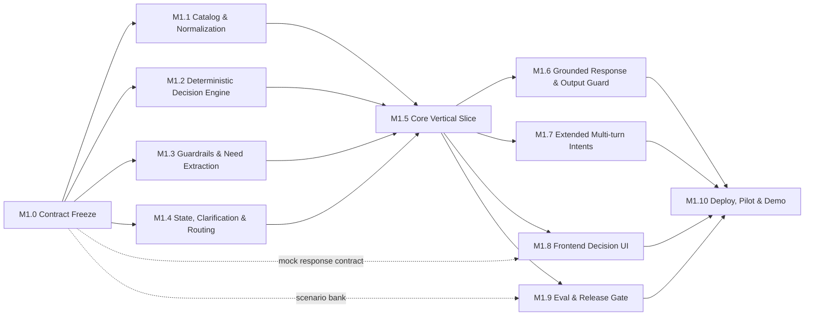

# Project Management — AI Product Comparison Advisor MVP

> **Last updated:** 2026-07-17
> **Current sprint deadline:** 2026-07-17 13:47 UTC (3 hours from task start)
> **Epic:** Release Milestone 1 — Máy lạnh decision-support advisor
> **Architecture source of truth:** `WORKFLOW-MVP(4).md`
> **Execution source:** `resources/AI_ADVISOR_M1_PHASE_MILESTONE_SPECS.md`
> **Progress source:** `resources/AI_ADVISOR_M1_PROGRESS.md`

## Status legend

- ⬜ Planned
- 🟨 In progress
- 🟦 Blocked
- ✅ Done
- ❌ Removed from scope

## Harness Execution Controls

This document is the Milestone 1 coordination ledger. It does not replace the Harness source hierarchy:

1. Accepted product contract lives in `docs/product/` when derived from the approved inputs.
2. Accepted story scope and its evidence live in `docs/stories/` and the Harness durable layer.
3. The authoritative operational proof view is `scripts/bin/harness-cli query matrix --active --summary`.
4. Durable architecture or contract changes require `docs/decisions/` records when the selected risk lane requires them.

For each accepted implementation change: record intake, create or update the appropriate story packet and durable story record, run the proof defined by that story, then record a Harness trace. This ledger may show planned work, but it must not mark a milestone implemented without its supporting proof.

| Proof type | Use for |
|---|---|
| Unit | Pure domain and application rules |
| Integration | Backend enforcement, data integrity, provider behavior, jobs, or service contracts |
| E2E | User-visible browser flows |
| Platform | Deployment, runtime, shell, mobile, or desktop behavior not provable at lower layers |

## 1. Phase Dashboard

| Phase | Milestones | Outcome / exit evidence | Status |
|---|---|---|---|
| Phase A — Contract & Testability | M1.0 | Contract tests and renderable mock payloads | 🟨 In progress |
| Phase B — Parallel Foundations | M1.1–M1.4 | Four independently testable foundations | ⬜ Planned |
| Phase C — Core Vertical Slice | M1.5 | Request reaches role winners with a trace | ⬜ Planned |
| Phase D — Trustworthy Customer Experience | M1.6–M1.8 | Validated response, multi-turn flows, and UI | ⬜ Planned |
| Phase E — Evaluation, Pilot & Release | M1.9–M1.10 | Release-gate report and deployed demo | ⬜ Planned |

## 2. Milestone Tracker

| ID | Milestone | Primary lane | Dependency | Demo proof | Expected Harness proof | Status |
|---|---|---|---|---|---|---|
| M1.0 | Architecture & Interface Contract Freeze | A | Approved workflow | Mock request/response and contract tests | Intake, contract validation, trace | 🟨 In progress |
| M1.1 | Catalog Search & Normalization | B | M1.0 | Normalized product search with cursor | Story packet, unit proof, trace | ⬜ Planned |
| M1.2 | Deterministic Decision Engine | B | M1.0 + fixtures | Eligible set, role winners, deduplicated cards | Story packet, unit proof, trace | ⬜ Planned |
| M1.3 | Guardrails & Intent/Need Extraction | C | M1.0 | Vietnamese request becomes validated need | Story packet, unit proof, trace | ⬜ Planned |
| M1.4 | State, Clarification, Routing & Persistence | C/D | M1.0 | Multi-turn clarification resumes by session | Story packet, unit/integration proof, trace | ⬜ Planned |
| M1.5 | Core FastAPI/LangGraph Vertical Slice | C/D | M1.1–M1.4 | Primary request becomes deterministic cards with trace | Story packet, integration proof, trace | ⬜ Planned |
| M1.6 | Grounded Response & Output Guard | C/F | M1.5 | Validated response and deterministic fallback | Story packet, unit/integration proof, trace | ⬜ Planned |
| M1.7 | Extended Multi-turn Intents | C/D | M1.5 | Compare, show-more, change, and stop script | Story packet, integration proof, trace | ⬜ Planned |
| M1.8 | Frontend Decision UI | E | M1.0 mock; M1.5 API | Real recommendation UI | Story packet, E2E proof, trace | ⬜ Planned |
| M1.9 | Langfuse Eval & Release Gate | F | Starts M1.0; integrates M1.5/M1.6 | 26-case M1 dataset release report | Story packet, dataset integrity, deterministic assertions, Langfuse import, trace | ⬜ Planned |
| M1.10 | Deployment, Pilot & Demo | D/A | M1.6–M1.9 | Deployed demo and pilot package | Story packet, platform proof, trace | ⬜ Planned |

## 3. Work Breakdown Structure

### 3.1 Phase A — Contract & Testability

- **M1.0 — Architecture and Interface Contract Freeze**
  - Freeze request, response, state, product, ranking, evidence, and error contracts.
  - Freeze the graph node sequence and route names.
  - Create product and model mock fixtures plus 8–12 smoke scenarios.
  - Convert ADR-001 to ADR-013 into an architecture-drift checklist.
  - Exit: `contract_tests` pass, the mock response renders, and owners approve the freeze.

### 3.2 Phase B — Parallel Foundations

- **M1.1 — Catalog Search and Product Normalization**
  - Build the raw catalog adapter, normalized fixtures, normalization functions, and evidence paths.
  - Implement `limit`, `cursor`, and `exclude_product_ids` with malformed/null/locale tests.
  - Exit: a fixed need retrieves and normalizes a repeatable catalog snapshot with passing unit tests.
- **M1.2 — Deterministic Air-Conditioner Decision Engine**
  - Implement room fit, hard-constraint filtering, independent role ranking, reason codes, deduplication, and no-match recovery.
  - Exit: tests cover happy path, duplicate winners, impossible constraints, missing evidence, and malformed data.
- **M1.3 — Input Guardrails, Intent Classification, and Need Extraction**
  - Implement deterministic input and scope checks before the LLM.
  - Add structured Nano extraction, Pydantic validation, deterministic retry/fallback, and Vietnamese intent tests.
  - Exit: at least 90% intent accuracy on the approved scenario set, with no guardrail bypass.
- **M1.4 — State Merge, Clarification, Routing, and Persistence**
  - Implement state invariants, correction precedence, material clarification logic, assumptions, routing, and checkpoint handling.
  - Exit: a multi-turn test preserves corrections and resumes with the same `session_id`.

### 3.3 Phase C — Core Vertical Slice

- **M1.5 — FastAPI and LangGraph Core Recommendation Slice**
  - Implement the gateway, approved node wiring, clarification/no-match branches, identifiers, trace spans, and integration tests.
  - Exit: the primary demo returns deterministic product-card selections; a missing budget returns one clarification question.

### 3.4 Phase D — Trustworthy Customer Experience

- **M1.6 — Grounded Explanation, Output Validation, and Next Action**
  - Build the explainer packet/schema, Main Selling Point policy, premium verdict, grounding checks, output rail, fallback, and next-question policy.
  - Exit: the primary scenario produces a validated `RecommendationOutput` and demonstrates its fallback path.
- **M1.7 — Multi-turn Intents and Recommendation Continuity**
  - Implement show-more, comparison, product detail, availability, changed-constraint, and stop flows.
  - Exit: a five-turn scripted conversation completes without state corruption or duplicate recommendations.
- **M1.8 — Frontend Decision-Support UI**
  - Build cards, merged badges, clarification/assumption UI, trade-offs, error/degraded/no-match states, show-more/compare, and API integration.
  - Exit: the UI passes the primary, clarification, no-match, show-more, and fallback scenarios with real API responses.

### 3.5 Phase E — Evaluation, Pilot & Release

- **M1.9 — Langfuse Observability, Evaluation Dataset, and Release Gate**
  - Use `data/aircon-m1-test-data/` as the sole Milestone 1 evaluation fixture bundle; do not use `data-template-enriched.json` for this MVP.
  - Load `aircon-m1-catalog-enriched.json` for the 14-product synthetic catalog and `aircon-m1-eval-cases.jsonl` for the 26-case Langfuse/CI dataset.
  - Run `aircon-m1-data-validation.json` before evaluation; require its `status: pass`, complete supported-intent coverage, and no integrity errors.
  - Use `AIRCON-M1-001` as the representative golden regression: `Em muốn mua máy lạnh dưới 20 triệu cho phòng 18m², tiết kiệm điện, ít ồn.` must return role winners `AC-M1-002`, `AC-M1-003`, and `AC-M1-006` for Best Overall, Best Value, and Cheapest Qualified.
  - Import each JSONL row into Langfuse with `input`, `expected`, and remaining metadata; retain deterministic assertions and graders in the release report.
  - Treat all fixture catalog data as synthetic test data, never current Điện Máy XANH product facts.
  - Exit: data validation passes and a reproducible 26-case evaluation produces a pass/fail report against the Milestone 1 thresholds.
- **M1.10 — Deployment, Pilot Pathway, and Demo Evidence**
  - Deliver deployment configuration, smoke tests, pilot/demo scripts, rollback procedure, and evidence package.
  - Exit: release gate and smoke tests pass; the demo/pilot package is complete.

## 4. Dependency and Parallel Work Board



| Parallel lane | Start condition | Current focus | Blocks |
|---|---|---|---|
| Catalog adapter | Product contracts frozen | Search, cursor, raw records | M1.5 |
| Normalization/domain rules | Normalized fixtures available | Capacity, constraints, ranking | M1.5 |
| Guardrails/intent | Intent schema frozen | Input rails, Nano structured output | M1.5 |
| State/clarification | State schema frozen | Merge, question policy, checkpointer | M1.5 |
| Frontend | Mock `RecommendationOutput` available | Cards, badges, states | M1.10 only; not M1.5 |
| Evaluation | Scenario contract available | 26-case M1 dataset, assertions, Langfuse import, grader skeleton | M1.10 only; not M1.5 |
| Deployment | API skeleton available | Config, health check, secrets | M1.10 |

**Critical path:** M1.0 → M1.1/M1.2/M1.3/M1.4 → M1.5 → M1.6 → M1.9 → M1.10.

## 5. Critical Path and Release Gate

### Critical path checklist

- [ ] M1.0 contracts frozen
- [ ] M1.1 searchable normalized catalog
- [ ] M1.2 deterministic filtering, ranking, and deduplication
- [ ] M1.3 guarded structured need extraction
- [ ] M1.4 state, clarification, routing, and persistence
- [ ] M1.5 end-to-end graph to role winners
- [ ] M1.6 grounded validated response
- [ ] M1.8 minimum viable UI integrated
- [ ] M1.9 blocking deterministic release gate passed
- [ ] M1.10 deployment smoke test passed

### Release blockers

Milestone 1 cannot be marked Done while any condition below is true:

- [ ] A P0 failure exists.
- [ ] A hard constraint is violated.
- [ ] An invalid product ID is displayed.
- [ ] An unsupported price or stock claim exists.
- [ ] Output schema pass rate is below 100%.
- [ ] Show-more returns duplicate product IDs.
- [ ] The M1 dataset integrity check does not report `status: pass` with complete intent coverage.
- [ ] `AIRCON-M1-001` does not return its approved deterministic role winners.
- [ ] Required citations or evidence are missing.
- [ ] The input guardrail can be bypassed before the intent model.
- [ ] An LLM performs ranking instead of deterministic code.
- [ ] UI diversity changes a truthful role winner.

### Release targets

| Metric | Target | Current |
|---|---:|---:|
| Intent accuracy | ≥ 0.90 | — |
| Clarification decision accuracy | ≥ 0.85 | — |
| Role-winner correctness | ≥ 0.90 | — |
| Human recommendation helpfulness | ≥ 0.80 | — |
| Main Selling Point relevance | ≥ 0.85 | — |
| Next-question relevance | ≥ 0.85 | — |
| Clarification p95 latency | ≤ 3 s | — |
| Recommendation p95 latency | ≤ 8 s | — |

## 6. Recommended 48-Hour Hackathon Schedule

```mermaid
gantt
    title AI Advisor Milestone 1 — 48-Hour Execution Plan
    dateFormat  HH:mm
    axisFormat  %H:%M

    section Contract
    M1.0 Contract freeze               :crit, a0, 00:00, 2h

    section Parallel foundations
    M1.1 Catalog and normalization     :a1, after a0, 8h
    M1.2 Decision engine               :a2, after a0, 8h
    M1.3 Guardrails and intent         :a3, after a0, 8h
    M1.4 State and clarification       :a4, after a0, 8h
    Frontend mock implementation       :a5, after a0, 12h
    M1 26-case evaluation dataset       :a6, after a0, 12h

    section Integration
    M1.5 Core vertical slice           :crit, b1, after a1, 6h
    M1.6 Grounded output               :crit, b2, after b1, 8h
    M1.7 Extended intents              :b3, after b1, 6h
    M1.8 API/UI integration            :b4, after b1, 8h

    section Quality and release
    M1.9 Eval gate and hardening       :crit, c1, after b2, 10h
    M1.10 Deploy and pilot demo        :crit, c2, after c1, 6h
```



> Mermaid time-only Gantt rendering differs across viewers. Durations and dependency order are authoritative.

## 7. Candidate Story Map

This is planning guidance only. The durable story record and proof status are maintained through `harness-cli story` and the active proof matrix; do not treat this table as an implemented-story register.

| Story ID | Title | Milestone | Lane | Priority | Status |
|---|---|---|---|---|---|
| US-101 | Request/session/trace gateway | M1.5 | D | P0 | planned |
| US-102 | Layered input guardrail | M1.3 | C | P0 | planned |
| US-103 | Vietnamese intent and need extraction | M1.3 | C | P0 | planned |
| US-104 | State merge and correction precedence | M1.4 | C/D | P0 | planned |
| US-105 | Material clarification policy | M1.4 | C | P0 | planned |
| US-106 | Catalog adapter and pagination | M1.1 | B | P0 | planned |
| US-107 | Product normalization and evidence | M1.1 | B | P0 | planned |
| US-108 | Hard constraint filtering | M1.2 | B | P0 | planned |
| US-109 | Deterministic role ranking | M1.2 | B | P0 | planned |
| US-110 | UI deduplication and alternative selection | M1.2/M1.8 | B/E | P0 | planned |
| US-111 | Grounded recommendation explanation | M1.6 | C | P0 | planned |
| US-112 | Output schema and grounding guard | M1.6 | C/F | P0 | planned |
| US-113 | Show-more continuation | M1.7 | C/D | P1 | planned |
| US-114 | Compare and product-detail paths | M1.7 | C/D | P1 | planned |
| US-115 | Product decision UI | M1.8 | E | P0 | planned |
| US-116 | Langfuse trace tree | M1.5/M1.9 | F | P0 | planned |
| US-117 | 26-case M1 evaluation dataset and golden regression | M1.9 | F/A | P0 | planned |
| US-118 | Release gate report | M1.9 | F/A | P0 | planned |
| US-119 | Deployment and smoke tests | M1.10 | D | P0 | planned |
| US-120 | Pilot and demo evidence package | M1.10 | A | P1 | planned |

## 8. Daily Update Template

```markdown
### [Date / Time]

**Completed**
- [Task ID] outcome and evidence link

**In progress**
- [Task ID] owner — expected completion

**Blocked**
- [Task ID] blocker — decision or owner needed

**Architecture risks**
- Any proposed change affecting an ADR or workflow order

**Next integration point**
- Branch, API, or schema to be ready, by whom, by when
```
