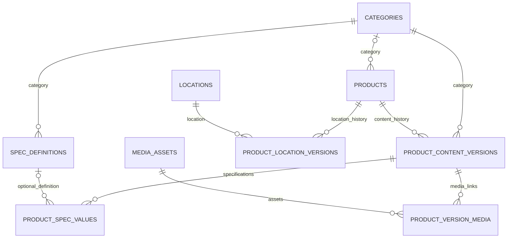

# Catalog Database Reference

This document is the data-access contract for frontend applications, agents,
reporting jobs, and other read-only product consumers.

> Read product data from PostgreSQL schema `catalog`. Do not query or depend on
> schema `crawler`. The `crawler` schema contains operational scheduling,
> attempts, errors, and incremental-crawl state; it is not part of the product
> read model.

The schema information below was verified against PostgreSQL 16.14 on
2026-07-18 using read-only `pg_catalog` queries. It describes 9 tables and 89
columns in `catalog`.

## Consumer rules

1. Always schema-qualify PostgreSQL relations as `catalog.<table>`.
2. Use `product_content_versions.valid_to IS NULL` for current product content.
3. Use `product_location_versions.valid_to IS NULL` for the current offer at a
   location.
4. Read complete ordered specifications from `product_spec_values`; order by
   `group_ordinal`, `item_ordinal`, then `id`.
5. Keep `specs_raw_json` as the source snapshot when a consumer needs the
   original ordered group structure.
6. Do not infer a commercial model from `products.source_product_key`.
   Commercial model information is in `product_content_versions.model`.
7. `created_by_task_id` is optional provenance. Catalog-only consumers should
   treat it as an opaque identifier or omit it; they must not join to
   `crawler.crawl_tasks`.
8. Do not use `crawler.crawl_observations`, crawl state, attempts, or errors as
   a source of product content.

## Table map

| Table | Purpose |
| --- | --- |
| `catalog.categories` | Product category reference data. |
| `catalog.products` | Stable source identity and canonical URL for a product. |
| `catalog.product_content_versions` | SCD2 history of common product content. |
| `catalog.spec_definitions` | Optional normalized specification definitions. |
| `catalog.product_spec_values` | Complete ordered EAV specification values for a content version. |
| `catalog.media_assets` | Deduplicated media URLs and metadata. |
| `catalog.product_version_media` | Ordered media attached to a content version. |
| `catalog.locations` | Locations used for location-specific offers. |
| `catalog.product_location_versions` | SCD2 history of price, stock, promotion, and delivery by location. |

## `catalog.categories`

| Column | PostgreSQL type | Nullable | Default | Key/reference |
| --- | --- | --- | --- | --- |
| `id` | `bigint` | No | `nextval('catalog.categories_id_seq')` | Primary key |
| `code` | `text` | No | — | Unique |
| `name` | `text` | No | — | — |
| `active` | `boolean` | No | `true` | — |

## `catalog.products`

Stable product identity. This table intentionally does not contain versioned
name, model, description, specifications, price, or stock.

| Column | PostgreSQL type | Nullable | Default | Key/reference |
| --- | --- | --- | --- | --- |
| `id` | `uuid` | No | — | Primary key |
| `source` | `text` | No | `'dienmayxanh'` | Unique with `canonical_url_hash` |
| `source_product_key` | `text` | Yes | — | Partial unique with `source` when non-null |
| `canonical_url` | `text` | No | — | — |
| `canonical_url_hash` | `character(64)` | No | — | Unique with `source` |
| `category_id` | `bigint` | Yes | — | FK → `catalog.categories(id)` |
| `status` | `text` | No | `'active'` | Check: `active`, `unavailable`, or `retired` |
| `first_seen_at` | `timestamp with time zone` | No | — | — |
| `last_seen_at` | `timestamp with time zone` | No | — | — |
| `sitemap_lastmod` | `date` | Yes | — | — |

Important uniqueness rules:

- Unique `(source, canonical_url_hash)`.
- Unique `(source, source_product_key)` when `source_product_key IS NOT NULL`.

## `catalog.product_content_versions`

SCD2 content history. A row with `valid_to IS NULL` is the current version.
The partial unique index `uq_product_content_current` guarantees at most one
current row for each product.

| Column | PostgreSQL type | Nullable | Default | Key/reference |
| --- | --- | --- | --- | --- |
| `id` | `uuid` | No | — | Primary key |
| `product_id` | `uuid` | No | — | FK → `catalog.products(id)`, delete cascade |
| `category_id` | `bigint` | No | — | FK → `catalog.categories(id)` |
| `name` | `text` | No | — | — |
| `brand` | `text` | Yes | — | — |
| `model` | `text` | Yes | — | Commercial model |
| `product_code` | `text` | Yes | — | — |
| `description` | `text` | Yes | — | — |
| `rating` | `numeric(3,2)` | Yes | — | — |
| `rating_count` | `bigint` | Yes | — | — |
| `sold_count` | `bigint` | Yes | — | — |
| `stock_status` | `text` | No | `'unknown'` | Common-page stock signal |
| `stock_raw` | `text` | Yes | — | Original stock text |
| `specs_raw_json` | `jsonb` | No | `'[]'::jsonb` | Complete ordered specification snapshot |
| `content_hash` | `character(64)` | No | — | SCD2 change hash |
| `valid_from` | `timestamp with time zone` | No | — | Version start |
| `valid_to` | `timestamp with time zone` | Yes | — | Null means current |
| `created_by_task_id` | `uuid` | Yes | — | Optional crawler provenance; do not join from catalog-only clients |

Relevant indexes:

- `uq_product_content_current`: unique `(product_id)` where `valid_to IS NULL`.
- `ix_product_content_history`: `(product_id, valid_from DESC)`.

## `catalog.spec_definitions`

Optional normalized definitions for specifications. A raw specification can be
stored even when no definition exists.

| Column | PostgreSQL type | Nullable | Default | Key/reference |
| --- | --- | --- | --- | --- |
| `id` | `bigint` | No | `nextval('catalog.spec_definitions_id_seq')` | Primary key |
| `category_id` | `bigint` | No | — | FK → `catalog.categories(id)` |
| `normalized_key` | `text` | No | — | Unique with `category_id` |
| `canonical_label` | `text` | No | — | — |
| `data_type` | `text` | No | `'text'` | — |
| `unit` | `text` | Yes | — | — |
| `aliases_json` | `jsonb` | No | `'[]'::jsonb` | — |

Unique constraint: `(category_id, normalized_key)`.

## `catalog.product_spec_values`

Complete specification EAV rows. Consumers must not collapse these rows into a
dictionary keyed only by label because labels may repeat across groups or may
have multiple values.

| Column | PostgreSQL type | Nullable | Default | Key/reference |
| --- | --- | --- | --- | --- |
| `id` | `bigint` | No | `nextval('catalog.product_spec_values_id_seq')` | Primary key |
| `content_version_id` | `uuid` | No | — | FK → `catalog.product_content_versions(id)`, delete cascade |
| `definition_id` | `bigint` | Yes | — | FK → `catalog.spec_definitions(id)` |
| `group_name` | `text` | Yes | — | Original group name |
| `group_ordinal` | `integer` | No | `0` | Group display order |
| `raw_label` | `text` | No | — | Original property label |
| `raw_value` | `text` | No | — | Original value text |
| `value_text` | `text` | Yes | — | Lightly normalized text |
| `value_number` | `numeric` | Yes | — | Parsed numeric value when reliable |
| `value_boolean` | `boolean` | Yes | — | Parsed boolean when reliable |
| `value_json` | `jsonb` | Yes | — | Structured parsed value |
| `unit` | `text` | Yes | — | Parsed unit when reliable |
| `item_ordinal` | `integer` | No | `0` | Item order inside its group |
| `source` | `text` | No | `'dom'` | Primary provenance |
| `provenance_json` | `jsonb` | No | `'[]'::jsonb` | Merged source provenance |
| `normalized_value_json` | `jsonb` | Yes | — | Additional normalized representation |
| `ordinal` | `integer` | No | `0` | Legacy/global order |

Ordering index:

`(content_version_id, group_ordinal, item_ordinal, id)`.

## `catalog.media_assets`

| Column | PostgreSQL type | Nullable | Default | Key/reference |
| --- | --- | --- | --- | --- |
| `id` | `uuid` | No | — | Primary key |
| `url` | `text` | No | — | — |
| `url_hash` | `character(64)` | No | — | Unique |
| `metadata_json` | `jsonb` | No | `'{}'::jsonb` | — |

## `catalog.product_version_media`

Many-to-many link between content versions and media assets.

| Column | PostgreSQL type | Nullable | Default | Key/reference |
| --- | --- | --- | --- | --- |
| `content_version_id` | `uuid` | No | — | Composite PK; FK → `catalog.product_content_versions(id)`, delete cascade |
| `media_id` | `uuid` | No | — | Composite PK; FK → `catalog.media_assets(id)` |
| `role` | `text` | No | `'gallery'` | — |
| `ordinal` | `integer` | No | `0` | Display order |

Primary key: `(content_version_id, media_id)`.

## `catalog.locations`

| Column | PostgreSQL type | Nullable | Default | Key/reference |
| --- | --- | --- | --- | --- |
| `id` | `bigint` | No | `nextval('catalog.locations_id_seq')` | Primary key |
| `code` | `text` | No | — | Unique |
| `name` | `text` | No | — | — |
| `province_id` | `bigint` | No | — | — |
| `province_name` | `text` | No | `''` | — |
| `ward_id` | `bigint` | No | — | — |
| `ward_name` | `text` | No | `''` | — |
| `address` | `text` | No | `''` | — |
| `config_hash` | `character(64)` | No | — | — |
| `active` | `boolean` | No | `true` | — |

## `catalog.product_location_versions`

SCD2 offer history for a product/location pair. A row with `valid_to IS NULL`
is current. The partial unique index `uq_product_location_current` guarantees
at most one current row per product/location pair.

| Column | PostgreSQL type | Nullable | Default | Key/reference |
| --- | --- | --- | --- | --- |
| `id` | `uuid` | No | — | Primary key |
| `product_id` | `uuid` | No | — | FK → `catalog.products(id)`, delete cascade |
| `location_id` | `bigint` | No | — | FK → `catalog.locations(id)` |
| `sale_price` | `bigint` | Yes | — | — |
| `list_price` | `bigint` | Yes | — | — |
| `currency` | `character(3)` | No | `'VND'` | — |
| `promotion_json` | `jsonb` | No | `'{}'::jsonb` | — |
| `stock_status` | `text` | No | `'unknown'` | — |
| `stock_raw` | `text` | Yes | — | Original stock text |
| `delivery_json` | `jsonb` | No | `'{}'::jsonb` | — |
| `returned_location_json` | `jsonb` | No | `'{}'::jsonb` | — |
| `state_hash` | `character(64)` | No | — | SCD2 change hash |
| `valid_from` | `timestamp with time zone` | No | — | Version start |
| `valid_to` | `timestamp with time zone` | Yes | — | Null means current |
| `created_by_task_id` | `uuid` | Yes | — | Optional crawler provenance; do not join from catalog-only clients |

Relevant indexes:

- `uq_product_location_current`: unique `(product_id, location_id)` where
  `valid_to IS NULL`.
- `ix_product_location_history`: `(product_id, location_id, valid_from DESC)`.

## Catalog-only query patterns

### Current product content

```sql
SELECT
    p.id,
    p.source,
    p.source_product_key,
    p.canonical_url,
    p.status,
    c.code AS category_code,
    c.name AS category_name,
    cv.id AS content_version_id,
    cv.name,
    cv.brand,
    cv.model,
    cv.product_code,
    cv.description,
    cv.rating,
    cv.rating_count,
    cv.sold_count,
    cv.stock_status,
    cv.stock_raw,
    cv.specs_raw_json,
    cv.valid_from
FROM catalog.products AS p
JOIN catalog.product_content_versions AS cv
  ON cv.product_id = p.id
 AND cv.valid_to IS NULL
LEFT JOIN catalog.categories AS c
  ON c.id = cv.category_id;
```

### Ordered specifications for current content

```sql
SELECT
    sv.content_version_id,
    sv.group_name,
    sv.group_ordinal,
    sv.raw_label,
    sv.raw_value,
    sv.value_text,
    sv.value_number,
    sv.value_boolean,
    sv.value_json,
    sv.unit,
    sv.item_ordinal,
    sv.source,
    sv.provenance_json
FROM catalog.product_content_versions AS cv
JOIN catalog.product_spec_values AS sv
  ON sv.content_version_id = cv.id
WHERE cv.product_id = $1
  AND cv.valid_to IS NULL
ORDER BY
    sv.group_ordinal,
    sv.item_ordinal,
    sv.id;
```

### Current location offer

```sql
SELECT
    lv.product_id,
    lv.location_id,
    l.code AS location_code,
    l.name AS location_name,
    lv.sale_price,
    lv.list_price,
    lv.currency,
    lv.promotion_json,
    lv.stock_status,
    lv.stock_raw,
    lv.delivery_json,
    lv.returned_location_json,
    lv.valid_from
FROM catalog.product_location_versions AS lv
JOIN catalog.locations AS l
  ON l.id = lv.location_id
WHERE lv.product_id = $1
  AND lv.valid_to IS NULL;
```

### Media for current content

```sql
SELECT
    m.id,
    m.url,
    m.metadata_json,
    vm.role,
    vm.ordinal
FROM catalog.product_content_versions AS cv
JOIN catalog.product_version_media AS vm
  ON vm.content_version_id = cv.id
JOIN catalog.media_assets AS m
  ON m.id = vm.media_id
WHERE cv.product_id = $1
  AND cv.valid_to IS NULL
ORDER BY vm.ordinal, m.id;
```

## Catalog relationships


