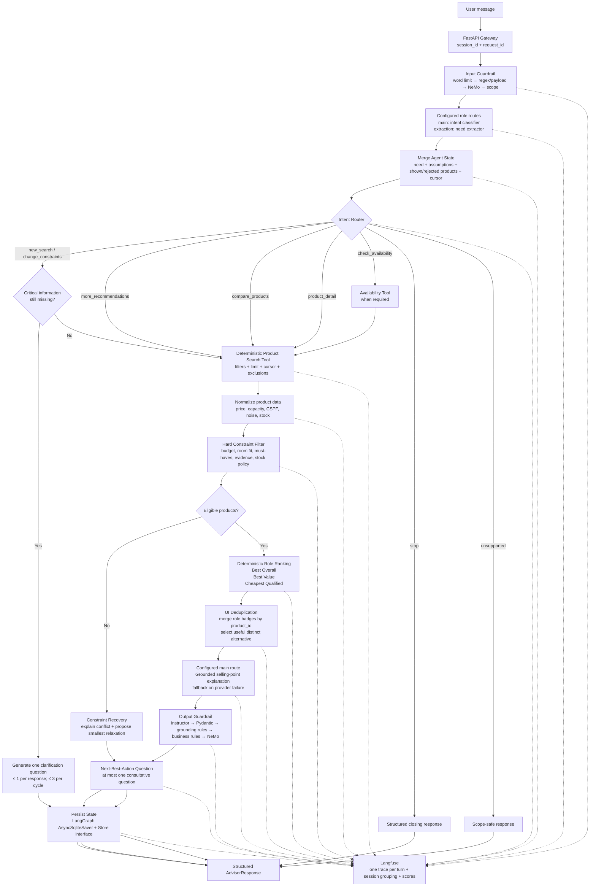
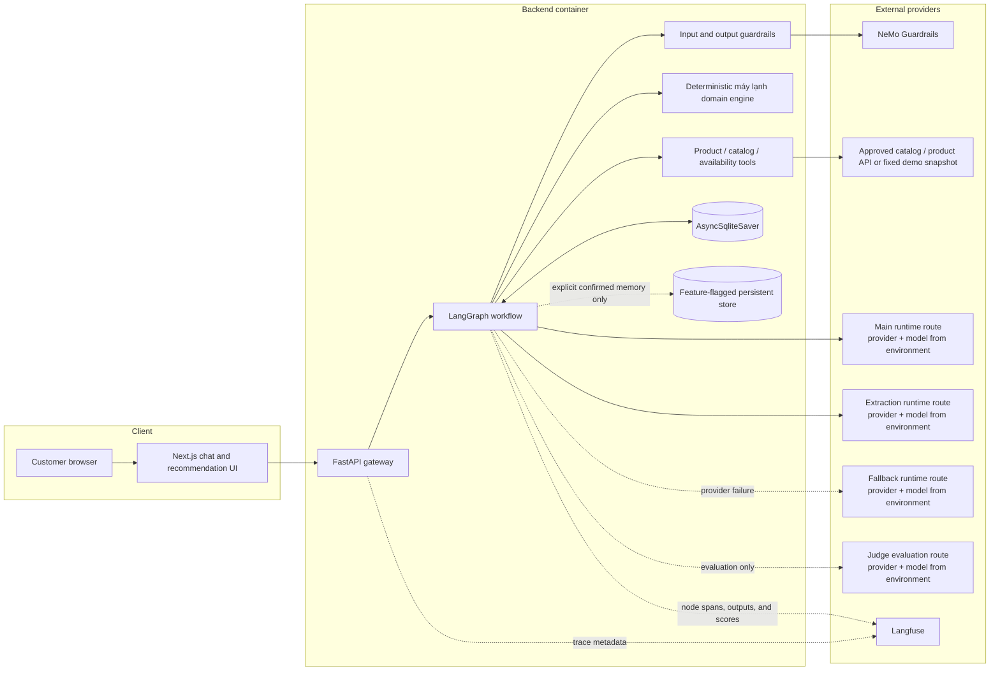

# Product Advisor M1 Product Architecture (Air-Conditioner slice)

> **Status:** Synced with the approved Milestone 1 PRD  
> **Scope:** One product category only — máy lạnh  
> **Primary language:** Vietnamese  
> **Authoritative sources:** `docs/product/air-conditioner-advisor-m1-contract.md`, Accepted ADRs, and `docs/product/requirements/air-conditioner-advisor-m1-prd.md`
> **Document role:** Implementation architecture, deployment topology, component ownership, and repository mapping  
> **Architecture style:** LangGraph orchestration + deterministic commerce logic + grounded LLM explanation  
> **Observability and evaluation:** Langfuse  
> **Last synchronization:** 2026-07-17

---

## 0. Document hierarchy and conformance rule

`docs/product/requirements/air-conditioner-advisor-m1-prd.md` is the approved
requirements baseline for:

- runtime node order;
- intent set and routing;
- model roles;
- clarification limits;
- state and memory semantics;
- product tool contracts;
- normalization and filtering rules;
- ranking roles;
- UI deduplication;
- guardrail order;
- output contract;
- tracing and evaluation;
- failure behavior;
- Milestone 1 Definition of Success.

This document may add implementation detail only when that detail does not change the approved behavior.

If this document conflicts with the accepted product contract or an Accepted
ADR that explicitly supersedes a named rule, that higher authority wins.
Otherwise the PRD wins, and this document must be updated before
implementation continues.

### Drift-sensitive architecture lock

The following changes require a new ADR or an explicit PRD amendment:

```text
runtime model responsibility or failure policy
workflow node order
supported intent or route
clarification limit
hard-constraint definition
ranking-role definition
Main Selling Point policy
UI deduplication policy
state or memory ownership
guardrail order
API contract
Langfuse release gate
product-category scope
```

---

## 1. System overview

The product is a Vietnamese, read-only, decision-support sales advisor for customers shopping for a máy lạnh.

The system can:

- understand and update a customer need;
- ask one materially useful clarification question at a time;
- search, normalize, and filter grounded product records;
- calculate three deterministic recommendation roles;
- explain verified winners and practical trade-offs;
- compare products, show more products, present product details, and check availability when grounded data exists;
- preserve multi-turn state and confirmed assumptions;
- trace and evaluate every user turn.

The system cannot:

- place an order;
- modify catalog, price, promotion, or stock data;
- perform payment;
- recommend unrelated product categories in Milestone 1;
- generate product facts from model memory;
- expose hidden prompts, credentials, or internal implementation secrets.

The product is an augmentation system. The customer keeps decision authority.

---

## 2. Non-negotiable architecture principles

1. **One category:** Milestone 1 supports máy lạnh only.
2. **Guard before model:** Input rails execute before the intent model.
3. **Hybrid responsibility:** The LLM understands and explains; deterministic code normalizes, filters, scores, selects roles, deduplicates, and validates.
4. **Hard constraints before ranking:** A high score can never rescue an ineligible product.
5. **Exactly three formal ranking roles:** Best Overall, Best Value, and Cheapest Qualified.
6. **Truth before UI diversity:** One product may win multiple roles; the UI merges its badges rather than altering the winners.
7. **Alternative is not a fourth role:** A useful distinct alternative may be selected for display, but it is not added to `RoleWinners`.
8. **User-first Main Selling Point:** The customer’s explicit primary priority controls the main recommendation lens.
9. **One question per response:** A clarification cycle may contain at most three clarification questions, but each response contains at most one.
10. **Grounded explanation only:** The configured `main` route receives verified products, deterministic winners, evidence, assumptions, and allowed next questions; provider failure advances once to `fallback`. Neither route can rerank.
11. **Explicit state:** Confirmed facts, unconfirmed assumptions, rejected products, shown products, and cursor are stored separately.
12. **LangGraph owns execution and persistence.**
13. **Langfuse owns traces, sessions, datasets, scores, and release evaluation.**
14. **Markdown is procedural context, not live customer memory.**
15. **The OpenRouter coding agent is development-only.**
16. **No vector store for product ranking in Milestone 1.**

---

## 3. Canonical runtime architecture

The runtime must preserve this order:

```text
Guard → Understand → Merge State → Route → Clarify or Search
→ Normalize → Filter → Rank → Deduplicate → Explain
→ Validate → Ask Next Question → Persist → Respond
```



### Route map

| Intent | Runtime route | Required result |
|---|---|---|
| `new_search` | clarification decision | clarification or recommendation |
| `change_constraints` | clarification decision | invalidate stale ranking when hard constraints changed |
| `more_recommendations` | deterministic search | reuse need, advance cursor only after successful presentation, exclude shown IDs |
| `compare_products` | deterministic search | grounded comparison |
| `product_detail` | deterministic search | grounded product detail |
| `check_availability` | search or availability tool | grounded availability result |
| `stop` | direct closing response | no consultative follow-up |
| `unsupported` | scope-safe response | no out-of-scope execution |

---

## 4. Deployment and component topology



### Deployment constraints

- Frontend and backend environment variables are separate.
- CORS is restricted to approved frontend origins.
- API keys remain in environment variables and are not committed.
- SQLite uses a persistent volume when cross-restart session continuity is required.
- Startup validates model, catalog, Langfuse, and guardrail configuration.
- A health endpoint and deterministic demo-data reset procedure are documented.
- Demo data and traces contain no unnecessary customer PII.
- The runtime remains read-only.

---

## 5. Component responsibilities

### 5.1 Frontend — Next.js

The frontend renders the server-owned structured response. It never recalculates eligibility, ranking, badges, prices, or evidence.

Recommended components:

- `ChatPanel`
- `ClarificationCard`
- `AssumptionBanner`
- `RecommendationSummary`
- `ProductCard`
- `PricePremiumPanel`
- `SourceDrawer`
- `MoreProductsAction`
- `ComparisonView`
- `ProductDetailView`
- `AvailabilityState`
- `NoMatchState`
- `GuardrailState`

Frontend rules:

- `session_id` is the server conversation key.
- Product cards are keyed by `product_id`.
- A product appears once even when it owns multiple role badges.
- A useful alternative must show its explicit `selection_reason`.
- Missing product fields are displayed as unknown or unavailable, never inferred.
- Internal chain-of-thought is never exposed; user-visible reason codes and evidence are allowed.

### 5.2 FastAPI gateway

Primary endpoint:

```text
POST /api/v1/advisor/respond
```

Responsibilities:

- validate the public request;
- generate `session_id` and `request_id` when absent;
- attach request timestamp and environment;
- enforce request-size and rate limits;
- call the LangGraph workflow;
- return the exact response envelope;
- never rank products.

Canonical request:

```python
class AdvisorRequest(BaseModel):
    session_id: str | None
    request_id: str | None
    user_id: str | None
    message: str
    region_code: str | None
```

Canonical response:

```python
class AdvisorResponse(BaseModel):
    session_id: str
    request_id: str
    trace_id: str
    data: RecommendationOutput
```

Canonical error response:

```python
class AdvisorError(BaseModel):
    session_id: str | None
    request_id: str | None
    trace_id: str | None
    error_code: str
    message: str
    retryable: bool
```

### 5.3 LangGraph workflow

The advisor is a constrained state machine, not an unconstrained ReAct agent.

Canonical nodes:

```text
input_guard
intent
merge_state
router
clarify
search
normalize
filter
recover
rank
dedupe
explain
output_guard
next_question
memory
```

A node may be internally decomposed, but the canonical order and responsibility boundaries must remain intact.

### 5.4 Model layer

| Runtime role | Environment-owned route | Allowed responsibility | Prohibited responsibility |
|---|---|---|---|
| Intent classifier | `main` then `fallback` | classify supported intent; produce structured output | need extraction, filtering, price math, role ranking, product invention |
| Need extractor | `extraction` then `fallback` | extract explicit need patch; produce structured output | intent routing, filtering, price math, role ranking, product invention |
| Grounded recommendation explainer | `main` then `fallback` | explain verified products, winners, trade-offs, premium verdicts, and customer benefit | independent reranking; unsupported claims; changing role winners |
| Evaluation judge | `judge` only; fail closed | score configured evaluation criteria | substituting a fallback score; changing runtime results |
| Engineering coding assistant | OpenRouter `deepseek/deepseek-v4-flash` | repository analysis, code/test generation, debugging, documentation updates | every customer-facing runtime action |

Runtime provider and model identifiers are operator environment values. Changing
an identifier requires only an environment edit. Changing role
responsibilities, route order, or failure policy requires an ADR or PRD
amendment. Prompt versions remain configuration values for observability.

### 5.5 Product, catalog, and availability tools

Canonical product search contract:

```python
def search_air_conditioners(
    filters: AirConditionerFilters,
    *,
    limit: int = 3,
    cursor: int = 0,
    exclude_product_ids: list[str] | None = None,
) -> ProductSearchResult:
    ...
```

Canonical result:

```python
class ProductSearchResult(BaseModel):
    products: list[RawProduct]
    next_cursor: int | None
    total_candidates: int
    has_more: bool
    source_snapshot: str
```

Policies:

```yaml
default_count: 3
maximum_per_response: 10
exclude_already_shown: true
reuse_current_need_for_more_results: true
rerank_if_constraints_change: true
```

Tool invariants:

- product search returns source records; normalization remains a separate deterministic step;
- `source_snapshot` identifies the catalog snapshot used for the turn;
- the tool never uses an LLM for numerical filtering;
- `exclude_product_ids` must be honored;
- availability claims require grounded availability data;
- tool failure never falls back to model-memory products.

### 5.6 Product normalization

Canonical normalized record:

```python
class NormalizedAirConditioner(BaseModel):
    product_id: str
    external_key: str
    name: str
    brand: str
    model: str | None

    sale_price_vnd: int | None
    list_price_vnd: int | None
    discount_percent: float | None

    region_code: str | None
    stock_status: Literal["available", "unavailable", "unknown"]

    horsepower_hp: float | None
    cooling_capacity_btu: int | None
    recommended_room_area_min_m2: float | None
    recommended_room_area_max_m2: float | None

    inverter: bool | None
    cspf: float | None
    energy_label_stars: int | None
    rated_power_w: float | None
    annual_energy_kwh: float | None

    indoor_noise_min_db: float | None
    indoor_noise_max_db: float | None

    warranty_months: int | None
    installation_cost_vnd: int | None
    promotion_text: str | None

    technical_specifications: dict
    product_information: dict

    rating: float | None
    sold_count: int | None

    source_url: str
    source_snapshot: str
```

Normalization must:

- convert price strings to integer VND;
- normalize HP and BTU;
- normalize room-size ranges;
- normalize CSPF and noise;
- normalize stock;
- preserve missing fields as `null`;
- preserve evidence paths for every factual field;
- reject malformed values instead of guessing.

### 5.7 Deterministic domain engine

Responsibilities:

- validate and normalize category data;
- calculate room-capacity fit;
- apply budget, room, required-attribute, evidence, and stock-policy constraints;
- retain exclusion reasons;
- calculate three role winners independently;
- retain score components, evidence references, and reason codes;
- deduplicate display cards;
- select a useful distinct alternative without creating a fourth formal ranking role;
- calculate price differences and deterministic facts supplied to the explanation model.

The domain engine must not call an LLM for eligibility or role selection.

---

## 6. Intent, clarification, and assumption architecture

### 6.1 Supported intent contract

```python
Intent = Literal[
    "new_search",
    "change_constraints",
    "more_recommendations",
    "compare_products",
    "product_detail",
    "check_availability",
    "stop",
    "unsupported",
]
```

### 6.2 Intent and need output

```json
{
  "intent": "new_search",
  "confidence": 0.97,
  "requested_product_count": 3,
  "constraints_changed": false,
  "need_patch": {
    "category": "air_conditioner",
    "budget_max_vnd": 20000000,
    "room_size_m2": 18,
    "room_type": null,
    "sunlight_exposure": null,
    "location": null,
    "priorities": [
      {
        "name": "energy_saving",
        "importance": "primary",
        "source": "explicit"
      }
    ]
  }
}
```

Extraction invariants:

- unknown values remain `null`;
- exact numeric values require explicit evidence;
- new explicit corrections override older state;
- explicit preferences override inferred preferences;
- the output is validated before state merge.

### 6.3 State-merge precedence

```text
Newest explicit user correction
> newest explicit user statement
> previously confirmed state
> previously inferred assumption
> default value
```

Changing a hard constraint invalidates previous role winners and display results.

### 6.4 Clarification decision

The system asks only when missing information can materially change:

- eligibility;
- capacity;
- a hard constraint;
- role winners;
- primary-priority interpretation;
- price, stock, or availability accuracy.

Priority:

```text
1. hard-filtering impact
2. material ranking impact
3. price, stock, or availability accuracy
```

Limits:

```yaml
max_questions_per_cycle: 3
max_questions_per_response: 1
force_exactly_three_questions: false
```

### 6.5 Assumptions

An assumption may be used only when it is useful but not dangerous enough to block.

Rules:

- material assumptions are visible;
- unconfirmed assumptions are not durable memory;
- the next question may invite confirmation;
- if the assumption could materially misfit capacity or eligibility, the system asks instead;
- user rejection removes or supersedes the assumption.

---

## 7. Filtering, ranking, and display architecture

### 7.1 Hard constraint filter

Canonical result:

```python
class FilterResult(BaseModel):
    eligible_products: list[NormalizedAirConditioner]
    excluded_products: list[ExcludedProduct]

class ExcludedProduct(BaseModel):
    product_id: str
    reasons: list[str]
```

Possible hard constraints:

- category is máy lạnh;
- price does not exceed a hard budget;
- capacity fits confirmed room conditions;
- explicit must-have attributes are present;
- stock satisfies the selected stock policy;
- required evidence is present.

Invariant:

```text
failed hard constraint → excluded product
```

No score or LLM explanation can override this result.

### 7.2 Constraint recovery

When the eligible set is empty, the system:

1. identifies the conflicting constraints;
2. proposes the smallest meaningful relaxation;
3. asks which constraint the customer wants to relax;
4. preserves original state until confirmation.

An ineligible product is never rendered as a normal recommendation.

### 7.3 Formal role ranking

Only these roles are part of `RoleWinners`:

```python
class RoleWinner(BaseModel):
    product_id: str
    role: Literal[
        "best_overall",
        "best_value",
        "cheapest_qualified",
    ]
    score: float | None
    evidence: list[EvidenceRef]
    reason_codes: list[str]

class RoleWinners(BaseModel):
    best_overall: RoleWinner
    best_value: RoleWinner
    cheapest_qualified: RoleWinner
```

Role intent:

- **Best Overall:** room fit + primary and secondary priority fit + data confidence + practicality + reasonable price position.
- **Best Value:** customer-relevant benefit relative to purchase price; unrelated features cannot inflate value.
- **Cheapest Qualified:** minimum `sale_price_vnd` inside the eligible set.

### 7.4 Main Selling Point

```text
explicit customer priority
+ verified product strength
+ meaningful differentiation
+ practical customer benefit
= Main Selling Point
```

For energy-saving claims, evidence priority is:

```text
1. CSPF, energy label, annual energy, rated power
2. inverter, eco mode, temperature-control technology
3. marketing text as supporting context only
```

### 7.5 UI deduplication and useful alternative

The deterministic role result remains unchanged even if one product owns multiple roles.

Transformation:

```text
RoleWinners
→ group badges by product_id
→ render each product once
→ if fewer than three distinct cards, select a useful distinct alternative
```

Alternative order:

```text
1. best for the primary priority
2. best lower-price alternative
3. best premium alternative
4. best meaningfully different trade-off
```

`best_for_primary_priority` may be a display badge or selection reason. It is not a fourth `RoleWinner`.

---

## 8. Grounded generation and response architecture

### 8.1 Explainer input boundary

The configured `main` route, followed by `fallback` on provider failure,
receives only:

- validated customer need;
- confirmed and disclosed assumptions;
- eligible products;
- deterministic role winners;
- deduplicated display products;
- verified evidence fields;
- calculated price differences;
- allowed next-question candidates.

It cannot receive an unrestricted catalog and cannot independently rerank.

### 8.2 Required product explanation

Each displayed product includes:

- role badges;
- why it fits the customer;
- Main Selling Point;
- practical benefit;
- price;
- one or more trade-offs;
- when not to choose it;
- evidence references;
- useful comparison to a relevant alternative when appropriate.

Premium verdict:

```python
WorthPayingMore = Literal["yes", "no", "conditional", "insufficient_data"]
```

### 8.3 Structured recommendation output

```python
class RecommendationOutput(BaseModel):
    answer_type: Literal[
        "clarification",
        "recommendation",
        "comparison",
        "more_products",
        "product_detail",
        "no_match",
        "guardrail_block",
        "stop",
    ]

    session_id: str
    request_id: str
    trace_id: str

    intent: str
    customer_need: AirConditionerNeed

    assumption_summary: list[Assumption]
    clarification_question: str | None

    role_winners: RoleWinners | None
    product_cards: list[ProductCard]
    price_premium_verdicts: list[PricePremiumVerdict]

    next_question: str | None
    citations: list[ProductCitation]

    has_more_products: bool
    next_cursor: int | None

    warnings: list[str]
```

### 8.4 Next-Best-Action Question

A useful recommendation or comparison ends with at most one consultative question, except when:

- intent is `stop`;
- the customer requests no more questions;
- the response is a guardrail refusal;
- no responsible question exists.

Prohibited behavior:

- artificial scarcity;
- unsupported urgency;
- pushing a more expensive product without customer benefit;
- repeating the same question;
- continuing after stop;
- calling a product “best” without a defined role and evidence.

---

## 9. Guardrail architecture

### 9.1 Input order

The exact order is:

```text
1. word count
2. deterministic regex and payload rules
3. NeMo input rail
4. product-domain scope check
5. intent classifier
```

Length policy:

```yaml
maximum_allowed_words: 149
block_if_word_count_gte: 150
```

Minimum deterministic checks:

- empty input;
- repeated-character abuse;
- prompt-injection markers;
- unsupported encoded payloads;
- excessively long URLs;
- unsafe execution requests;
- hidden-prompt or credential requests.

### 9.2 Output order

The exact order is:

```text
1. Instructor structured-output parsing
2. Pydantic schema validation
3. deterministic grounding checks
4. deterministic business-rule checks
5. NeMo output rail
6. safe structured response
```

Retry policy:

```yaml
instructor_max_retries: 1
```

After the second failure:

- do not call the explanation model again;
- return a deterministic fallback;
- add `output_validation_failed` to the trace;
- preserve state for a later retry.

Mandatory assertions:

- every product ID exists in retrieved products;
- every price and stock claim matches retrieved data;
- no hard-budget or room-capacity violation;
- all evidence paths exist;
- no unsupported electricity-savings amount;
- no duplicate product card;
- role badges match deterministic winners;
- no more than one next question;
- every factual claim has an allowed evidence source;
- missing data is disclosed.

---

## 10. State and memory architecture

### 10.1 Canonical LangGraph state

```python
class AdvisorState(TypedDict):
    messages: list
    session_id: str
    request_id: str
    user_id: str | None
    turn_number: int

    current_intent: Literal[
        "new_search",
        "change_constraints",
        "more_recommendations",
        "compare_products",
        "product_detail",
        "check_availability",
        "stop",
        "unsupported",
    ]

    customer_need: AirConditionerNeed

    pending_assumptions: list[Assumption]
    confirmed_assumptions: list[Assumption]
    clarification_count: int

    requested_product_count: int
    shown_product_ids: list[str]
    rejected_product_ids: list[str]
    ranking_cursor: int

    retrieved_product_ids: list[str]
    eligible_product_ids: list[str]
    excluded_products: list[ExcludedProduct]

    role_winners: RoleWinners | None
    display_product_ids: list[str]
    recommendation_output: RecommendationOutput | None

    guardrail_flags: list[str]
    trace_id: str
```

State invariants:

- shown IDs are unique;
- clarification count resets for a materially new search;
- confirmed assumptions survive turns;
- unconfirmed assumptions remain visibly labeled;
- cursor advances only after successful product presentation;
- a changed hard constraint invalidates prior ranking;
- explanation output never becomes ranking truth.

### 10.2 Conversation state

```yaml
langgraph_checkpointer: AsyncSqliteSaver
thread_key: session_id
```

Conversation state includes current need, assumptions, clarification progress, shown and rejected products, cursor, and current intent.

### 10.3 Persistent customer memory

Only explicitly confirmed, useful preferences may be stored.

Rules:

- no inferred assumption becomes durable memory;
- no unnecessary sensitive data;
- cross-session memory is feature-flagged;
- persistent customer memory is not required for the core Milestone 1 demo.

### 10.4 Versioned procedural context

```text
backend/app/context/
├── SOUL.md
├── SALES_POLICY.md
├── AIRCON_DOMAIN.md
├── CLARIFICATION_POLICY.md
├── RECOMMENDATION_POLICY.md
├── OUTPUT_POLICY.md
└── GUARDRAILS.md
```

Prompts load only the context needed by the current node. Numerical ranking logic remains in Python or versioned YAML.

---

## 11. Langfuse tracing and evaluation

### 11.1 Trace boundary and tree

```text
one user turn = one trace
one conversation = one session_id
```

Canonical tree:

```text
advisor_turn
├── input_guardrail
├── intent_classifier
├── state_merge
├── intent_router
├── clarification_decision
├── product_search
├── product_normalization
├── hard_constraint_filter
├── availability_decision
├── best_overall_ranking
├── best_value_ranking
├── cheapest_qualified_ranking
├── ui_deduplication
├── response_generation
├── output_validation
├── next_question_selection
└── memory_write
```

Required metadata:

```json
{
  "environment": "hackathon-m1",
  "session_id": "session_123",
  "request_id": "request_456",
  "turn_number": 4,
  "intent_model_role": "main",
  "intent_provider": "<resolved-provider>",
  "intent_model": "<resolved-model>",
  "extraction_model_role": "extraction",
  "extraction_provider": "<resolved-provider>",
  "extraction_model": "<resolved-model>",
  "explanation_model_role": "main",
  "explanation_provider": "<resolved-provider>",
  "explanation_model": "<resolved-model>",
  "judge_model_role": "judge",
  "judge_provider": "<resolved-provider>",
  "judge_model": "<resolved-model>",
  "prompt_version": "recommendation-v1",
  "aircon_rules_version": "v1",
  "catalog_snapshot": "catalog-m1",
  "input_word_count": 19,
  "intent": "new_search",
  "clarification_count": 1,
  "retrieved_product_count": 25,
  "eligible_product_count": 14,
  "displayed_product_count": 3,
  "shown_product_ids": ["p01", "p03", "p09"],
  "guardrail_status": "passed"
}
```

Required scores:

- `input_guardrail_pass`
- `intent_correctness`
- `need_extraction_correctness`
- `clarification_decision_correctness`
- `hard_constraint_pass`
- `role_winner_correctness`
- `grounding_correctness`
- `main_selling_point_relevance`
- `tradeoff_quality`
- `next_question_relevance`
- `output_schema_pass`
- `human_helpfulness`

### 11.2 Evaluation dataset

Exactly 26 cases, per the frozen fixture contract in
`docs/product/air-conditioner-advisor-m1-contract.md`.

Required coverage:

- complete request;
- missing room size, budget, or location;
- energy-saving and low-noise priorities;
- conflicting priorities;
- impossible constraints;
- comparison and show-more;
- changed budget and room size;
- product detail;
- no eligible product;
- missing CSPF or noise;
- unavailable stock;
- duplicate role winners;
- prompt injection and oversized input;
- malformed product data;
- output validation failure;
- stop;
- rejected recommendation.

### 11.3 Release gate

```yaml
milestone_1_release_gate:
  block_if:
    p0_failures: "> 0"
    hard_constraint_violations: "> 0"
    invalid_product_ids: "> 0"
    unsupported_price_or_stock_claims: "> 0"
    output_schema_pass_rate: "< 1.0"
    duplicate_more_recommendations_rate: "> 0"
    missing_required_citations: "> 0"

  target:
    intent_accuracy: ">= 0.90"
    clarification_decision_accuracy: ">= 0.85"
    role_winner_correctness: ">= 0.90"
    human_recommendation_helpfulness: ">= 0.80"
    main_selling_point_relevance: ">= 0.85"
    next_question_relevance: ">= 0.85"

  latency:
    clarification_p95_seconds: "<= 3"
    recommendation_p95_seconds: "<= 8"
```

No release may be marked complete by demo quality alone.

---

## 12. Failure and fallback architecture

| Failure | Required behavior |
|---|---|
| Intent model failure | Exhaust `main` then `fallback`; if both fail, use deterministic keyword fallback, mark `intent_model_degraded`, avoid destructive state changes, and ask one safe question if still ambiguous |
| Need extraction failure | Exhaust `extraction` then `fallback`; if both fail, preserve prior need state, mark extraction degraded, and never invent numeric values |
| Explanation provider failure | Exhaust `main` then `fallback`; if both fail, render the deterministic grounded response and record degradation |
| Judge provider failure | Fail closed without a substituted score |
| NeMo unavailable | Keep deterministic input/output checks, mark `guardrail_degraded`, continue only for low-risk shopping requests |
| Product tool unavailable | Return data-unavailable response; never generate product recommendations from model memory |
| Missing product evidence | Keep only when eligibility remains valid, lower data confidence when applicable, disclose the missing field, make no claim from it |
| No eligible product | Run constraint recovery and preserve original constraints until user confirmation |
| Output validation failure | Render deterministic names, prices, badges, and links; omit unsupported prose; record failure in Langfuse |
| Memory failure | Finish current turn using in-memory state, mark `memory_write_failed`, warn only if continuity may be affected |
| Malformed product data | Reject malformed field or product according to eligibility impact; never guess |
| Missing price | Do not make price-dependent eligibility, Best Value, Cheapest Qualified, or premium claims without sufficient grounded data |
| Missing stock | Use `unknown`; do not claim available or unavailable |
| Missing energy evidence | Do not claim energy-saving superiority from marketing text alone |

---

## 13. Security and trust controls

- Public request and every structured model response are Pydantic validated.
- Input and output rails follow the fixed order in Section 9.
- Runtime data access is read-only.
- API keys and secrets are environment-only.
- CORS, request size, and rate limits are enforced.
- Traces avoid unnecessary raw personal information.
- Product facts must originate from the active `source_snapshot`.
- Prompt and model versions are included in every trace.
- AI-generated code is reviewed before merge.
- The coding assistant receives customer conversations only for an explicit development task.
- Markdown files are reviewed and version controlled.
- Unsupported claims fail closed to a deterministic response.

---

## 14. Repository mapping

```text
backend/
├── app/
│   ├── api/
│   │   └── advisor.py
│   ├── graph/
│   │   ├── workflow.py
│   │   ├── state.py
│   │   └── nodes/
│   │       ├── input_guard.py
│   │       ├── intent.py
│   │       ├── merge_state.py
│   │       ├── router.py
│   │       ├── clarify.py
│   │       ├── search.py
│   │       ├── normalize.py
│   │       ├── filter.py
│   │       ├── recover.py
│   │       ├── rank.py
│   │       ├── dedupe.py
│   │       ├── explain.py
│   │       ├── output_guard.py
│   │       ├── next_question.py
│   │       └── memory.py
│   ├── domain/
│   │   └── air_conditioner/
│   │       ├── schema.py
│   │       ├── normalization.py
│   │       ├── capacity_rules.py
│   │       ├── constraints.py
│   │       ├── ranking.py
│   │       ├── clarification.py
│   │       └── evidence.py
│   ├── tools/
│   │   ├── product_search.py
│   │   ├── catalog_adapter.py
│   │   └── availability.py
│   ├── guardrails/
│   │   ├── input_rules.py
│   │   ├── output_rules.py
│   │   └── nemo/
│   ├── models/
│   │   ├── openai_intent.py
│   │   └── openai_explainer.py
│   ├── memory/
│   │   ├── checkpointer.py
│   │   └── store.py
│   ├── observability/
│   │   └── langfuse.py
│   └── context/
│       ├── SOUL.md
│       ├── SALES_POLICY.md
│       ├── AIRCON_DOMAIN.md
│       ├── CLARIFICATION_POLICY.md
│       ├── RECOMMENDATION_POLICY.md
│       ├── OUTPUT_POLICY.md
│       └── GUARDRAILS.md
├── evals/
│   ├── dataset.jsonl
│   ├── assertions.py
│   ├── graders.py
│   └── run_eval.py
└── tests/
    ├── unit/
    ├── integration/
    └── regression/

frontend/
├── app/
├── components/
└── lib/
    └── advisor-api.ts
```

The frontend mapping is an implementation addition. The backend mapping is synchronized to the PRD.

---

## 15. Approved ADRs

| ADR | Decision | Milestone 1 choice |
|---|---|---|
| ADR-001 | Category scope | Máy lạnh only |
| ADR-002 | Primary customer | Value-conscious comparison shopper |
| ADR-003 | Main Selling Point | Hybrid, user-first |
| ADR-004 | Formal roles | Best Overall, Best Value, Cheapest Qualified |
| ADR-005 | Duplicate winners | Preserve truth, merge UI badges |
| ADR-006 | Ranking ownership | LLM understands; deterministic code filters/ranks; LLM explains |
| ADR-007 | Runtime models | Environment-owned `main`, `extraction`, `fallback`, and fail-closed `judge` routes |
| ADR-008 | State and persistence | LangGraph checkpointer plus Store interface |
| ADR-009 | Procedural context | Versioned Markdown; live state in persistence |
| ADR-010 | Pagination | Initial three cards; variable limit, cursor, exclusions |
| ADR-011 | Sales follow-up | At most one consultative question per useful response |
| ADR-012 | Guardrails | Word limit, regex/payload, NeMo, scope, Instructor, Pydantic, deterministic checks |
| ADR-013 | Observability | Langfuse trace, dataset, scores, release gate |
| ADR-014 | Product ranking retrieval | Structured catalog, no vector store |

---

## 16. Architecture acceptance criteria

- [x] Input guardrails execute before the configured `main` intent route.
- [x] The exact input order is word count → regex/payload → NeMo → scope.
- [ ] Every supported intent reaches the route specified in Section 3.
- [x] Structured intent and need fields are validated.
- [ ] Explicit user corrections win state merge.
- [ ] Each response contains at most one clarification question.
- [ ] Each clarification cycle contains at most three questions.
- [x] Search supports `limit`, `cursor`, and `exclude_product_ids`.
- [x] Search returns `total_candidates` and `source_snapshot`.
- [x] Normalization preserves `null` and evidence paths.
- [x] Hard constraints execute before role ranking.
- [x] No ineligible product reaches a normal recommendation.
- [ ] Only three formal roles exist in `RoleWinners`.
- [ ] Duplicate role winners render once with merged badges.
- [ ] A useful alternative does not alter role truth.
- [ ] The configured explanation route receives verified results only and cannot rerank.
- [ ] Intent and explanation use `main` then `fallback`; need extraction uses `extraction` then `fallback`.
- [ ] Judge evaluation uses `judge` only and fails closed.
- [ ] Output validation follows Instructor → Pydantic → grounding → business rules → NeMo.
- [ ] Failed output uses at most one retry and then deterministic fallback.
- [x] State matches the canonical `AdvisorState`.
- [ ] Cursor advances only after successful product presentation.
- [ ] API envelopes include `session_id`, `request_id`, `trace_id`, and `data`.
- [ ] Every turn produces the canonical Langfuse tree, metadata, and scores.
- [ ] The 26-case dataset passes every blocking release gate.
- [ ] Public deployment completes clarification, recommendation, comparison, show-more, no-match, product-detail, availability, stop, and guardrail paths.

---

## 17. Context-drift prevention checklist

Run this checklist whenever the PRD, architecture, prompts, schemas, or graph change.

| Check | Required equality |
|---|---|
| Model routing | intent/explanation = `main` → `fallback`; extraction = `extraction` → `fallback`; judge = `judge` only |
| Formal role enum | exactly three roles |
| Intent enum | exactly eight intents |
| Input guard order | word count → regex/payload → NeMo → scope → intent |
| Output guard order | Instructor → Pydantic → grounding → business rules → NeMo |
| Clarification limits | one per response, three per cycle |
| Product search fields | products, next_cursor, total_candidates, has_more, source_snapshot |
| API envelope | response uses `data`, not `result` |
| State fields | includes request/user IDs, rejected IDs, excluded products, flags |
| Cursor behavior | advances after successful presentation only |
| Trace tree | includes router and availability decision; no fourth role-ranking span |
| Release blockers | exactly match the PRD gate |
| Repository backend | matches the PRD mapping |
| Document authority | Product contract or explicitly superseding Accepted ADR first; PRD next |

A CI conformance test should parse enums and schemas from code and compare them with versioned fixtures derived from the PRD.
