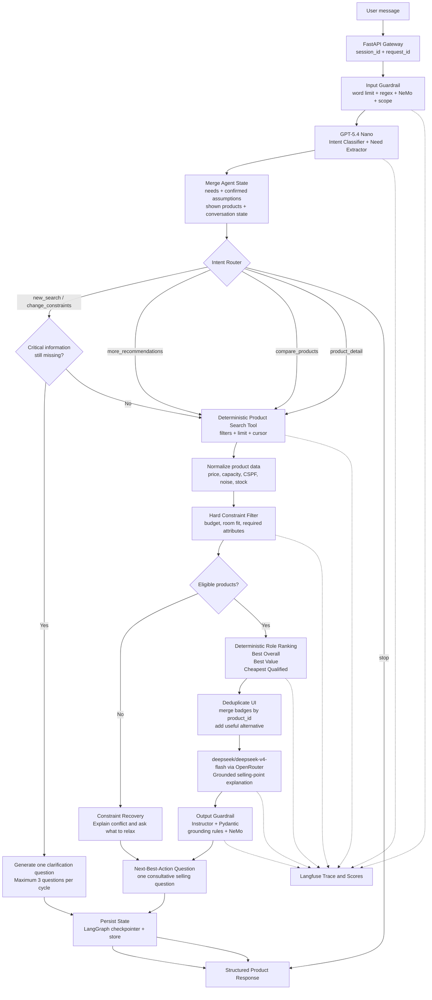

# Air Conditioner Advisor — Milestone 1 Product Requirements (PRD)

> **Project:** AI Product Comparison Advisor — Điện Máy XANH  
> **Milestone:** Milestone 1 — the first vertical slice of the general
> multi-category advisor; air conditioners (máy lạnh) are M1's example use case  
> **Status:** Approved architecture baseline  
> **Scope:** One product category only — máy lạnh (ADR-001); later milestones
> extend the same framework to the retailer's other categories  
> **Primary language:** Vietnamese  
> **Document role:** Source of truth for runtime workflow, agent state, tool contracts, guardrails, memory, tracing, and Definition of Success

---

## 0. Purpose

Milestone 1 proves that the system can:

1. Understand a Vietnamese air-conditioner shopping request.
2. Ask only the missing questions that materially change recommendation quality.
3. Retrieve and normalize product data through deterministic tools.
4. Apply hard constraints before ranking.
5. Calculate truthful role winners:
   - **Best Overall**
   - **Best Value**
   - **Cheapest Qualified**
6. Deduplicate the UI without changing ranking truth.
7. Explain each recommendation using grounded product evidence and the customer’s primary buying priority.
8. End each useful answer with one consultative next-best-action question.
9. Persist conversation state and confirmed assumptions.
10. Trace the complete workflow and evaluate it in Langfuse.

The product is a **decision-support sales advisor**, not an autonomous purchasing agent.

---

## 1. Non-negotiable architecture decisions

The following decisions are approved and must not drift during Milestone 1:

- The MVP supports **one category only: máy lạnh**.
- Ranking is **hybrid**:
  - LLM understands intent and priorities.
  - Deterministic code performs normalization, filtering, scoring, role selection, and UI deduplication.
  - LLM explains only verified results.
- The Main Selling Point policy is **hybrid, user-first**.
- Recommendation roles are calculated separately:
  - Best Overall
  - Best Value
  - Cheapest Qualified
- One product may truthfully win several roles.
- The UI deduplicates by `product_id` and merges badges.
- Initial recommendation output normally shows three distinct product cards.
- “Show more products” is supported through `limit`, `cursor`, and `exclude_product_ids`; the backend must not assume a fixed total of three products.
- The agent asks **up to three clarification questions per cycle**, not always exactly three.
- Every useful recommendation or comparison ends with at most one consultative selling question.
- Input guardrails run before the intent model.
- Output validation uses Instructor, Pydantic, deterministic grounding checks, and NeMo.
- LangGraph owns execution and persistence.
- Langfuse owns observability, traces, datasets, and evaluation scores.
- Markdown files provide stable procedural context; they are not the live customer-memory database.
- The OpenRouter coding agent is part of the engineering harness only and is not part of the customer-facing runtime.

---

## 2. Milestone 1 product promise

> Given a Vietnamese shopping request for a máy lạnh and grounded product data, the system returns either one necessary clarification question or a verified recommendation result containing truthful role winners, practical trade-offs, evidence-backed Main Selling Points, and one useful next action.

### Primary example

> “Em muốn mua máy lạnh dưới 20 triệu cho phòng 18m², tiết kiệm điện, ít ồn.”

### Expected behavior

The system should:

- detect the product category;
- extract the budget;
- extract the room size;
- identify `tiết kiệm điện` as the primary priority when explicitly stated;
- identify `ít ồn` as a secondary priority;
- ask about only missing information that can materially affect capacity, filtering, or ranking;
- recommend products only after enough information is available;
- explain whether paying more is worthwhile for this customer;
- never invent price, stock, promotion, specifications, or savings claims.

---

## 3. Milestone 1 canonical architecture

This diagram is the approved runtime architecture and is the source of truth.



### Architecture invariant

No implementation may bypass this order:

```text
Guard → Understand → Merge State → Route → Clarify or Search
→ Normalize → Filter → Rank → Deduplicate → Explain
→ Validate → Ask Next Question → Persist → Respond
```

---

## 4. End-to-end workflow

### 4.1 Request entry

The FastAPI Gateway receives:

```json
{
  "session_id": "session_123",
  "request_id": "request_456",
  "user_id": null,
  "message": "Em muốn mua máy lạnh dưới 20 triệu cho phòng 18m², tiết kiệm điện, ít ồn.",
  "region_code": "HCM"
}
```

The gateway must:

- validate required fields;
- generate `session_id` and `request_id` when absent;
- attach request timestamp;
- attach runtime environment;
- pass the request to the LangGraph workflow;
- never perform product ranking itself.

### 4.2 Input guardrail

The input guardrail runs before any customer-facing LLM call.

Order:

```text
1. Word-count rule
2. Deterministic regex and payload rules
3. NeMo input rail
4. Product-domain scope check
5. Intent classifier
```

#### Word limit

```yaml
maximum_allowed_words: 149
block_if_word_count_gte: 150
```

Blocked response:

> “Yêu cầu đang dài hơn giới hạn 150 từ. Hãy gửi ngắn gọn bốn thông tin: diện tích phòng, ngân sách, ưu tiên chính và khu vực sử dụng.”

#### Regex and deterministic checks

At minimum:

- empty input;
- repeated-character abuse;
- obvious prompt-injection markers;
- unsupported encoded payloads;
- excessively long URLs;
- unsafe execution requests;
- requests to reveal hidden prompts or internal credentials.

#### Scope behavior

Supported:

- buying a máy lạnh;
- asking for recommendations;
- comparing products;
- requesting more results;
- changing constraints;
- checking product details;
- asking about price, stock, promotion, warranty, or installation when data exists.

Unsupported:

- unrelated product categories in Milestone 1;
- requests to purchase automatically;
- requests to modify catalog data;
- requests for hidden system prompts;
- requests to run arbitrary code.

### 4.3 Intent classification and need extraction

#### Runtime model

```yaml
provider: OpenAI
model_role: intent_classifier_and_need_extractor
model: GPT-5.4 Nano
structured_output: required
```

#### Supported intents

```python
Intent = Literal[
    "new_search",
    "change_constraints",
    "more_recommendations",
    "compare_products",
    "product_detail",
    "check_availability",
    "stop",
    "unsupported",
]
```

#### Intent output contract

```json
{
  "intent": "new_search",
  "confidence": 0.97,
  "requested_product_count": 3,
  "constraints_changed": false,
  "need_patch": {
    "category": "air_conditioner",
    "budget_max_vnd": 20000000,
    "room_size_m2": 18,
    "room_type": null,
    "sunlight_exposure": null,
    "location": null,
    "priorities": [
      {
        "name": "energy_saving",
        "importance": "primary",
        "source": "explicit"
      },
      {
        "name": "low_noise",
        "importance": "secondary",
        "source": "explicit"
      }
    ]
  }
}
```

#### Extraction rules

- Unknown values remain `null`.
- The model must not infer exact numeric values without explicit evidence.
- User corrections override previous state.
- Explicit user preferences override inferred preferences.
- Extracted fields are validated before merging into state.

### 4.4 Merge Agent State

The state-merge node combines:

- current request;
- current intent;
- extracted need patch;
- previous confirmed customer need;
- pending assumptions;
- confirmed assumptions;
- rejected products;
- already shown products;
- ranking cursor;
- conversation turn count.

#### Merge precedence

```text
Newest explicit user correction
> newest explicit user statement
> previously confirmed state
> previously inferred assumption
> default value
```

### 4.5 Intent Router

| Intent | Route |
|---|---|
| `new_search` | clarification decision |
| `change_constraints` | clarification decision |
| `more_recommendations` | deterministic search |
| `compare_products` | deterministic search |
| `product_detail` | deterministic search |
| `check_availability` | deterministic search or availability tool |
| `stop` | structured closing response |
| `unsupported` | scope-safe response |

The router must not use product data to invent a route. It routes only from validated intent and state.

### 4.6 Clarification decision

The agent asks **up to three clarification questions per cycle**.

It asks only when the missing information can materially affect:

- eligibility;
- capacity;
- hard constraints;
- role winners;
- interpretation of the customer’s primary priority.

#### Clarification priority

```text
1. Missing variable that can change hard filtering
2. Missing variable that can change ranking materially
3. Missing variable needed for price, stock, or availability accuracy
```

#### Clarification limits

```yaml
max_questions_per_cycle: 3
max_questions_per_response: 1
force_exactly_three_questions: false
```

### 4.7 Assumption policy

When information is useful but not critical enough to block the recommendation, the system may proceed with a disclosed assumption.

```json
{
  "field": "sunlight_exposure",
  "assumed_value": "normal",
  "reason": "User did not mention strong direct sunlight",
  "impact": "May affect recommended cooling capacity",
  "confirmation_status": "unconfirmed"
}
```

Rules:

- Assumptions are visible in the response when material.
- Unconfirmed assumptions do not become durable customer memory.
- The final question may invite confirmation.
- If the assumption could cause a materially wrong product match, the agent must ask instead of assuming.

### 4.8 Deterministic Product Search Tool

The search tool must support a variable number of requested products.

```python
def search_air_conditioners(
    filters: AirConditionerFilters,
    *,
    limit: int = 3,
    cursor: int = 0,
    exclude_product_ids: list[str] | None = None,
) -> ProductSearchResult:
    ...
```

#### Search-result contract

```python
class ProductSearchResult(BaseModel):
    products: list[RawProduct]
    next_cursor: int | None
    total_candidates: int
    has_more: bool
    source_snapshot: str
```

#### Pagination policy

```yaml
default_count: 3
maximum_per_response: 10
exclude_already_shown: true
reuse_current_need_for_more_results: true
rerank_if_constraints_change: true
```

#### More-recommendations behavior

```text
reuse current CustomerNeed
→ continue from ranking cursor
→ exclude shown product IDs
→ retrieve the next eligible products
→ preserve the same ranking policy
```

### 4.9 Product normalization

Raw product data is normalized before constraints or ranking.

Required normalized fields for máy lạnh:

```python
class NormalizedAirConditioner(BaseModel):
    product_id: str
    external_key: str
    name: str
    brand: str
    model: str | None

    sale_price_vnd: int | None
    list_price_vnd: int | None
    discount_percent: float | None

    region_code: str | None
    stock_status: Literal["available", "unavailable", "unknown"]

    horsepower_hp: float | None
    cooling_capacity_btu: int | None
    recommended_room_area_min_m2: float | None
    recommended_room_area_max_m2: float | None

    inverter: bool | None
    cspf: float | None
    energy_label_stars: int | None
    rated_power_w: float | None
    annual_energy_kwh: float | None

    indoor_noise_min_db: float | None
    indoor_noise_max_db: float | None

    warranty_months: int | None
    installation_cost_vnd: int | None
    promotion_text: str | None

    technical_specifications: dict
    product_information: dict

    rating: float | None
    sold_count: int | None

    source_url: str
    source_snapshot: str
```

#### Normalization responsibilities

- convert price strings to integer VND;
- normalize HP and BTU;
- normalize room-size ranges;
- normalize CSPF;
- normalize noise values;
- normalize stock;
- preserve missing fields as `null`;
- preserve evidence paths for every field;
- reject malformed values instead of guessing.

### 4.10 Hard Constraint Filter

Filtering is deterministic and runs before ranking.

Possible hard constraints:

- product category must be máy lạnh;
- price must not exceed hard budget;
- cooling capacity must fit the confirmed room conditions;
- product must contain required attributes;
- product must satisfy explicit must-have features;
- stock must satisfy the selected stock policy;
- required evidence must be present.

#### Filter-result contract

```python
class FilterResult(BaseModel):
    eligible_products: list[NormalizedAirConditioner]
    excluded_products: list[ExcludedProduct]

class ExcludedProduct(BaseModel):
    product_id: str
    reasons: list[str]
```

#### Rule invariant

A high score cannot override a failed hard constraint.

### 4.11 Constraint recovery

When no product is eligible, the system must not invent a recommendation.

It should:

1. explain which constraints conflict;
2. identify the smallest meaningful relaxation;
3. ask the user what to change;
4. preserve the original state until the user confirms.

Example:

> “Hiện chưa có mẫu nào vừa dưới 12 triệu, phù hợp phòng 25m² và có độ ồn rất thấp. Bạn muốn tôi ưu tiên giữ ngân sách hay giữ tiêu chí chạy êm?”

### 4.12 Deterministic role ranking

The three role winners are calculated independently.

#### Best Overall

```text
maximize:
room fit
+ primary priority fit
+ secondary-priority fit
+ data confidence
+ product practicality
+ reasonable price position
```

#### Best Value

```text
maximize:
relevant customer benefit
relative to purchase price
```

Features unrelated to the customer’s need must not inflate the value score.

#### Cheapest Qualified

```text
minimize sale_price_vnd
within eligible product set
```

#### Role-winner contract

```python
class RoleWinner(BaseModel):
    product_id: str
    role: Literal[
        "best_overall",
        "best_value",
        "cheapest_qualified",
    ]
    score: float | None
    evidence: list[EvidenceRef]
    reason_codes: list[str]

class RoleWinners(BaseModel):
    best_overall: RoleWinner
    best_value: RoleWinner
    cheapest_qualified: RoleWinner
```

### 4.13 Hybrid, user-first Main Selling Point

Definition:

> The Main Selling Point is the strongest evidence-backed product benefit that directly supports the customer’s primary buying priority and meaningfully distinguishes the product from relevant alternatives.

Formula:

```text
Main Selling Point
=
explicit customer priority
+ verified product strength
+ meaningful differentiation
+ practical customer benefit
```

#### Evidence priority for energy saving

```text
1. Standardized or measurable evidence
   - CSPF
   - energy-efficiency label
   - annual energy consumption
   - rated power

2. Supporting technical evidence
   - inverter
   - eco mode
   - temperature-control technology

3. Marketing text
   - supporting context only
   - never sufficient by itself
```

An unrelated feature may be presented as a secondary benefit, but it may not replace the customer’s stated primary priority.

### 4.14 UI deduplication

Role winners remain truthful even when one product wins multiple roles.

#### Ranking source of truth

```json
{
  "role_winners": {
    "best_overall": "aircon_a",
    "best_value": "aircon_a",
    "cheapest_qualified": "aircon_b"
  }
}
```

#### UI transformation

```json
{
  "product_cards": [
    {
      "product_id": "aircon_a",
      "badges": ["best_overall", "best_value"]
    },
    {
      "product_id": "aircon_b",
      "badges": ["cheapest_qualified"]
    },
    {
      "product_id": "aircon_c",
      "badges": ["best_for_primary_priority"],
      "selection_reason": "useful_distinct_alternative"
    }
  ]
}
```

#### Alternative-selection order

```text
1. Best for the user’s primary priority
2. Best lower-price alternative
3. Best premium alternative
4. Best meaningfully different trade-off
```

Never change a true role winner merely to make the UI appear diverse.

### 4.15 Grounded explanation generation

#### Runtime model

```yaml
provider: OpenAI
model_role: grounded_recommendation_explainer
provider: OpenRouter
model: deepseek/deepseek-v4-flash
structured_output: required
```

The explanation model receives only:

- validated customer need;
- confirmed and disclosed assumptions;
- eligible products;
- deterministic role winners;
- deduplicated display products;
- verified evidence fields;
- calculated price differences;
- allowed next-question candidates.

It must not independently rerank products.

#### Required explanation content

For every displayed product:

- role badges;
- why it fits this customer;
- Main Selling Point;
- practical customer benefit;
- price;
- one or more trade-offs;
- when the customer should not choose it;
- evidence references;
- comparison against at least one relevant alternative when useful.

#### Premium verdict

```python
WorthPayingMore = Literal["yes", "no", "conditional", "insufficient_data"]
```

The model must directly answer what the price difference buys and whether it is worthwhile for this customer.

### 4.16 Output guardrail

Order:

```text
1. Instructor structured-output parsing
2. Pydantic schema validation
3. Deterministic grounding checks
4. Deterministic business-rule checks
5. NeMo output rail
6. Safe structured response
```

#### Retry policy

```yaml
instructor_max_retries: 1
```

After the second failure:

- do not call the model again;
- return a deterministic fallback;
- add `output_validation_failed` to trace;
- preserve enough state for a retry on the next user turn.

#### Mandatory deterministic checks

- every `product_id` exists in retrieved products;
- every displayed price equals retrieved data;
- stock claims equal retrieved data;
- no recommendation violates hard budget;
- no recommendation violates room-capacity rules;
- evidence paths exist;
- no unsupported electricity-saving amount;
- no duplicate product cards;
- role badges match deterministic role winners;
- no more than one next question;
- every factual claim has an allowed evidence source;
- missing data is disclosed instead of invented.

### 4.17 Next-Best-Action Question

Each useful response ends with at most one consultative selling question, except when:

- user intent is `stop`;
- the user explicitly asks for no more questions;
- the response is a guardrail refusal;
- no responsible next question exists.

#### Allowed question categories

After initial recommendation:

> “Bạn muốn tôi so sánh trực tiếp lựa chọn phù hợp nhất với lựa chọn rẻ nhất không?”

After comparison:

> “Bạn ưu tiên tiết kiệm 3 triệu lúc mua hay tiết kiệm điện và chạy êm hơn khi sử dụng lâu dài?”

After more recommendations:

> “Bạn muốn tôi thu hẹp danh sách theo giá thấp hơn hay theo khả năng tiết kiệm điện tốt hơn?”

When location is missing:

> “Bạn đang ở khu vực nào để tôi kiểm tra giá và tình trạng hàng chính xác hơn?”

When an assumption remains:

> “Tôi đang tạm giả định phòng không bị nắng trực tiếp nhiều; giả định này có đúng không?”

#### Prohibited sales behavior

- artificial scarcity;
- unsupported urgency;
- manipulating the user toward a more expensive product;
- repeating the same question;
- continuing after the user says stop;
- calling a product “best” without a defined role and evidence.

### 4.18 Structured response contract

```python
class RecommendationOutput(BaseModel):
    answer_type: Literal[
        "clarification",
        "recommendation",
        "comparison",
        "more_products",
        "product_detail",
        "no_match",
        "guardrail_block",
        "stop",
    ]

    session_id: str
    request_id: str
    trace_id: str

    intent: str
    customer_need: AirConditionerNeed

    assumption_summary: list[Assumption]
    clarification_question: str | None

    role_winners: RoleWinners | None
    product_cards: list[ProductCard]
    price_premium_verdicts: list[PricePremiumVerdict]

    next_question: str | None
    citations: list[ProductCitation]

    has_more_products: bool
    next_cursor: int | None

    warnings: list[str]
```

---

## 5. LangGraph state contract

```python
class AdvisorState(TypedDict):
    messages: list
    session_id: str
    request_id: str
    user_id: str | None
    turn_number: int

    current_intent: Literal[
        "new_search",
        "change_constraints",
        "more_recommendations",
        "compare_products",
        "product_detail",
        "check_availability",
        "stop",
        "unsupported",
    ]

    customer_need: AirConditionerNeed

    pending_assumptions: list[Assumption]
    confirmed_assumptions: list[Assumption]
    clarification_count: int

    requested_product_count: int
    shown_product_ids: list[str]
    rejected_product_ids: list[str]
    ranking_cursor: int

    retrieved_product_ids: list[str]
    eligible_product_ids: list[str]
    excluded_products: list[ExcludedProduct]

    role_winners: RoleWinners | None
    display_product_ids: list[str]
    recommendation_output: RecommendationOutput | None

    guardrail_flags: list[str]
    trace_id: str
```

### State invariants

- `shown_product_ids` contains no duplicates.
- `clarification_count` resets when a materially new search begins.
- confirmed assumptions survive subsequent turns.
- unconfirmed assumptions remain visibly labeled.
- `ranking_cursor` advances only after successful product presentation.
- a changed hard constraint invalidates previous ranking results.
- explanation output never becomes the source of truth for role winners.

---

## 6. Memory architecture

### 6.1 Conversation state

Purpose:

- current shopping need;
- current assumptions;
- clarification progress;
- shown and rejected products;
- pagination cursor;
- current intent.

Milestone 1 implementation:

```yaml
langgraph_checkpointer: AsyncSqliteSaver
thread_key: session_id
```

### 6.2 Persistent customer memory

Store only explicitly confirmed facts.

```json
{
  "primary_priority": "energy_saving",
  "preferred_budget_range": "15–20 triệu",
  "room_type": "bedroom",
  "preferred_brands": ["Daikin", "Panasonic"]
}
```

Rules:

- inferred assumptions are not durable memory;
- sensitive data must not be stored without need;
- cross-session memory remains feature-flagged for Milestone 1;
- persistent memory is not required to pass the core Milestone 1 demo.

### 6.3 Markdown procedural context

```text
backend/context/
├── SOUL.md
├── SALES_POLICY.md
├── AIRCON_DOMAIN.md
├── CLARIFICATION_POLICY.md
├── RECOMMENDATION_POLICY.md
├── OUTPUT_POLICY.md
└── GUARDRAILS.md
```

| File | Responsibility |
|---|---|
| `SOUL.md` | identity, tone, boundaries |
| `SALES_POLICY.md` | consultative selling behavior |
| `AIRCON_DOMAIN.md` | stable category language and definitions |
| `CLARIFICATION_POLICY.md` | when and what to ask |
| `RECOMMENDATION_POLICY.md` | role definitions and Main Selling Point policy |
| `OUTPUT_POLICY.md` | required response structure |
| `GUARDRAILS.md` | allowed scope, refusal, and fallback behavior |

Rules:

- markdown files are version-controlled;
- prompts load only the files needed by the current node;
- no full-repository context dump;
- numerical ranking rules live in Python or versioned YAML;
- live customer state never uses markdown as its primary database.

---

## 7. Development coding agent

The coding agent belongs to the engineering harness, not to the customer runtime.

```yaml
provider: OpenRouter
model: deepseek/deepseek-v4-flash
allowed:
  - repository analysis
  - code generation
  - test generation
  - debugging
  - documentation updates
prohibited:
  - customer product recommendation
  - runtime role ranking
  - direct access to customer conversations without an explicit development task
```

The coding agent must follow repository context files and approved ADRs.

---

## 8. Langfuse tracing

Langfuse records one trace per user turn. All turns in the same conversation share `session_id`.

### Trace tree

```text
advisor_turn
├── input_guardrail
├── intent_classifier
├── state_merge
├── intent_router
├── clarification_decision
├── product_search
├── product_normalization
├── hard_constraint_filter
├── availability_decision
├── best_overall_ranking
├── best_value_ranking
├── cheapest_qualified_ranking
├── ui_deduplication
├── response_generation
├── output_validation
├── next_question_selection
└── memory_write
```

### Required metadata

```json
{
  "environment": "hackathon-m1",
  "session_id": "session_123",
  "request_id": "request_456",
  "turn_number": 4,
  "intent_model": "gpt-5.4-nano",
"response_model": "deepseek/deepseek-v4-flash",
  "prompt_version": "recommendation-v1",
  "aircon_rules_version": "v1",
  "catalog_snapshot": "catalog-m1",
  "input_word_count": 19,
  "intent": "new_search",
  "clarification_count": 1,
  "retrieved_product_count": 25,
  "eligible_product_count": 14,
  "displayed_product_count": 3,
  "shown_product_ids": ["p01", "p03", "p09"],
  "guardrail_status": "passed"
}
```

### Required scores

- `input_guardrail_pass`;
- `intent_correctness`;
- `need_extraction_correctness`;
- `clarification_decision_correctness`;
- `hard_constraint_pass`;
- `role_winner_correctness`;
- `grounding_correctness`;
- `main_selling_point_relevance`;
- `tradeoff_quality`;
- `next_question_relevance`;
- `output_schema_pass`;
- `human_helpfulness`.

---

## 9. Langfuse Definition of Success

Milestone 1 is evaluated through:

1. deterministic assertions;
2. human review;
3. calibrated model-based grading for semantic qualities;
4. latency and cost metrics;
5. trace inspection for failures.

### Initial dataset

Exactly 26 cases, per the frozen fixture contract in
`docs/product/air-conditioner-advisor-m1-contract.md`.

Coverage:

- complete recommendation request;
- missing room size;
- missing budget;
- missing location;
- main priority: energy saving;
- main priority: low noise;
- conflicting priorities;
- impossible constraints;
- comparison intent;
- show-more intent;
- changed budget;
- changed room size;
- product-detail request;
- no eligible product;
- missing CSPF;
- missing noise data;
- unavailable stock;
- duplicate role winners;
- prompt injection;
- oversized input;
- malformed product data;
- output validation failure;
- user says stop;
- user rejects a recommendation.

### Release gate

```yaml
milestone_1_release_gate:
  block_if:
    p0_failures: "> 0"
    hard_constraint_violations: "> 0"
    invalid_product_ids: "> 0"
    unsupported_price_or_stock_claims: "> 0"
    output_schema_pass_rate: "< 1.0"
    duplicate_more_recommendations_rate: "> 0"
    missing_required_citations: "> 0"

  target:
    intent_accuracy: ">= 0.90"
    clarification_decision_accuracy: ">= 0.85"
    role_winner_correctness: ">= 0.90"
    human_recommendation_helpfulness: ">= 0.80"
    main_selling_point_relevance: ">= 0.85"
    next_question_relevance: ">= 0.85"

  latency:
    clarification_p95_seconds: "<= 3"
    recommendation_p95_seconds: "<= 8"
```

---

## 10. Failure and fallback behavior

### 10.1 Intent model failure

- use a deterministic keyword-based intent fallback for supported intents;
- mark `intent_model_degraded`;
- avoid destructive state changes;
- ask one safe clarification when intent remains ambiguous.

### 10.2 NeMo unavailable

- keep word-count, regex, scope, and deterministic output checks;
- mark `guardrail_degraded`;
- continue only for low-risk shopping requests.

### 10.3 Product tool unavailable

> “Tôi chưa thể truy xuất dữ liệu sản phẩm lúc này nên chưa thể đưa ra gợi ý đáng tin cậy. Bạn có thể thử lại sau.”

Do not generate products from model memory.

### 10.4 Missing product evidence

- preserve the product only if missing data does not invalidate eligibility;
- lower data-confidence score where applicable;
- disclose the missing field;
- do not make claims based on that field.

### 10.5 No eligible products

Use constraint recovery. Never present an ineligible product as a normal recommendation.

### 10.6 Output validation failure

- render deterministic product names, prices, role badges, and source links;
- omit unsupported natural-language claims;
- record the validation error in Langfuse.

### 10.7 Memory failure

- continue the current turn using in-memory state;
- return the response;
- mark `memory_write_failed`;
- warn the user only when session continuity may be affected.

---

## 11. API contracts

### 11.1 Request

```python
class AdvisorRequest(BaseModel):
    session_id: str | None
    request_id: str | None
    user_id: str | None
    message: str
    region_code: str | None
```

### 11.2 Response

```python
class AdvisorResponse(BaseModel):
    session_id: str
    request_id: str
    trace_id: str
    data: RecommendationOutput
```

### 11.3 Error response

```python
class AdvisorError(BaseModel):
    session_id: str | None
    request_id: str | None
    trace_id: str | None
    error_code: str
    message: str
    retryable: bool
```

---

## 12. Recommended repository mapping

```text
backend/
├── app/
│   ├── api/
│   │   └── advisor.py
│   ├── graph/
│   │   ├── workflow.py
│   │   ├── state.py
│   │   └── nodes/
│   │       ├── input_guard.py
│   │       ├── intent.py
│   │       ├── merge_state.py
│   │       ├── router.py
│   │       ├── clarify.py
│   │       ├── search.py
│   │       ├── normalize.py
│   │       ├── filter.py
│   │       ├── recover.py
│   │       ├── rank.py
│   │       ├── dedupe.py
│   │       ├── explain.py
│   │       ├── output_guard.py
│   │       ├── next_question.py
│   │       └── memory.py
│   ├── domain/
│   │   └── air_conditioner/
│   │       ├── schema.py
│   │       ├── normalization.py
│   │       ├── capacity_rules.py
│   │       ├── constraints.py
│   │       ├── ranking.py
│   │       ├── clarification.py
│   │       └── evidence.py
│   ├── tools/
│   │   ├── product_search.py
│   │   ├── catalog_adapter.py
│   │   └── availability.py
│   ├── guardrails/
│   │   ├── input_rules.py
│   │   ├── output_rules.py
│   │   └── nemo/
│   ├── models/
│   │   ├── openai_intent.py
│   │   └── openai_explainer.py
│   ├── memory/
│   │   ├── checkpointer.py
│   │   └── store.py
│   ├── observability/
│   │   └── langfuse.py
│   └── context/
│       ├── SOUL.md
│       ├── SALES_POLICY.md
│       ├── AIRCON_DOMAIN.md
│       ├── CLARIFICATION_POLICY.md
│       ├── RECOMMENDATION_POLICY.md
│       ├── OUTPUT_POLICY.md
│       └── GUARDRAILS.md
├── evals/
│   ├── dataset.jsonl
│   ├── assertions.py
│   ├── graders.py
│   └── run_eval.py
└── tests/
    ├── unit/
    ├── integration/
    └── regression/
```

---

## 13. Implementation order

The team should implement Milestone 1 as vertical slices.

### Slice 1 — Guarded request to structured need

```text
FastAPI
→ input guardrail
→ intent classifier
→ validated CustomerNeed
→ Langfuse trace
```

### Slice 2 — Clarification loop and state persistence

```text
CustomerNeed
→ clarification decision
→ one question
→ persisted LangGraph state
→ updated state on next turn
```

### Slice 3 — Product search, normalization, and hard filtering

```text
CustomerNeed
→ deterministic search
→ normalize
→ filter
→ eligible products and exclusion reasons
```

### Slice 4 — Role ranking and deduplication

```text
eligible products
→ Best Overall
→ Best Value
→ Cheapest Qualified
→ deduplicated display cards
```

### Slice 5 — Grounded explanation and output guardrail

```text
verified ranking
→ deepseek/deepseek-v4-flash explanation via OpenRouter
→ Instructor/Pydantic
→ deterministic grounding checks
→ structured output
```

### Slice 6 — Show-more behavior

```text
more_recommendations
→ reuse state
→ cursor
→ exclude shown products
→ next results
```

### Slice 7 — Langfuse evaluation release gate

```text
dataset
→ trace
→ deterministic assertions
→ human/semantic scores
→ Milestone 1 pass/fail
```

---

## 14. Definition of Ready

An implementation ticket is Ready only when:

- outcome is observable;
- acceptance criteria are testable;
- required data exists;
- dependencies are known;
- one owner is assigned;
- the ticket can be completed in a short hackathon timebox;
- demo proof is defined.

---

## 15. Definition of Done

A ticket is Done only when:

```text
code completed
+ integrated into the approved workflow
+ acceptance criteria verified
+ trace visible in Langfuse
+ regression test added when fixing a bug
+ no known P0 issue
+ demo proof available
```

---

## 16. Milestone 1 end-to-end acceptance criteria

Milestone 1 passes only when all conditions below are met:

- a Vietnamese request reaches the FastAPI Gateway;
- input guardrails run before the intent model;
- GPT-5.4 Nano returns validated structured intent and need fields;
- state is merged without overwriting explicit user corrections;
- the system asks no more than one clarification question per response;
- no cycle exceeds three clarification questions;
- search supports variable `limit` and cursor pagination;
- normalization handles price, capacity, CSPF, noise, and stock;
- hard constraints run before ranking;
- no over-budget or unsuitable-capacity product is recommended;
- Best Overall, Best Value, and Cheapest Qualified are calculated independently;
- truthful duplicate role winners are preserved;
- the UI contains no duplicate product card;
- an additional alternative has an explicit selection reason;
- deepseek/deepseek-v4-flash explains only validated products and evidence;
- each product includes a Main Selling Point linked to the user’s priority;
- trade-offs are visible;
- price-premium verdict is direct when evidence is sufficient;
- missing data is disclosed;
- the answer contains no unsupported price, stock, promotion, or savings claim;
- output passes Instructor, Pydantic, deterministic checks, and NeMo;
- each useful answer contains at most one consultative next question;
- state persists through the LangGraph checkpointer;
- each turn appears as a complete Langfuse trace;
- the Langfuse evaluation dataset passes the release gate.

---

## 17. Approved ADR summary

```text
ADR-001 — One category only: máy lạnh
Accepted

ADR-002 — Primary customer: value-conscious comparison shopper
Accepted

ADR-003 — Main Selling Point: hybrid, user-first
Accepted

ADR-004 — Separate recommendation roles
Best Overall, Best Value, Cheapest Qualified
Accepted

ADR-005 — Truthful role winners with deduplicated UI
Accepted

ADR-006 — Hybrid Ranking
LLM understands; deterministic code filters and ranks; LLM explains
Accepted

ADR-007 — Runtime model routing
GPT-5.4 Nano for intent and extraction
deepseek/deepseek-v4-flash through OpenRouter for grounded explanation
Accepted

ADR-008 — LangGraph state and persistence
Checkpointer plus Store interface
Accepted

ADR-009 — Markdown context policy
Procedural context in .md; live state in persistence layer
Accepted

ADR-010 — Recommendation pagination
Initial three cards; variable limit and cursor for more products
Accepted

ADR-011 — Consultative sales question
At most one useful next question per response
Accepted

ADR-012 — Layered guardrails
Word limit, regex, NeMo, Instructor, Pydantic, deterministic grounding
Accepted

ADR-013 — Langfuse observability and Definition of Success
One trace per turn; session grouping; dataset release gate
Accepted
```

---

## 18. Change-control rule

Any change that affects one of the following requires a new ADR or an explicit amendment to this document:

- runtime model role;
- workflow node order;
- clarification limit;
- hard constraints;
- ranking-role definitions;
- Main Selling Point policy;
- UI deduplication policy;
- memory ownership;
- guardrail order;
- Langfuse release gate;
- product-category scope.

Implementation details may evolve, but they must preserve the approved architecture and behavior contracts in this document.
