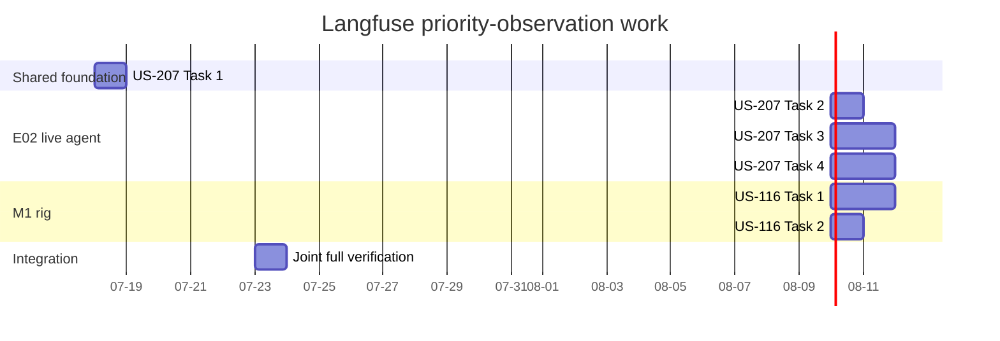

# Current Mission

Parallel decision: after US-207 Task 1 stabilizes the shared adapter contract,
US-207 Tasks 3–4 and US-116 Task 1 can proceed in parallel. US-116 remains
ownership-blocked until USER1/USER2 file overlap is resolved. Final verification
waits for both story plans and ownership clearance.

## Assignment

Đinh Nhật Thành owns Langfuse observation planning and implementation for both
backend agent surfaces:

- US-207 — E02 live multi-category agent priority observability.
- US-116 — M1 implemented-node priority observability, after US-207 provides
   the shared adapter.

Previous architecture-document work is no longer part of this tracker.

## Trace Objective

Trace the information that helps engineers diagnose bugs and improve model
behavior over time:

- root request, final response, IDs, intent, route, flags, and state summary;
- guardrail result;
- full raw model prompts/outputs and provider-attempt errors/fallbacks;
- state update;
- policy retrieval or product search;
- filter/ranking summary;
- response generation and output validation;
- final error/degradation status.

Do not add a span for every helper. Langfuse failures remain fail-open. Never
capture credentials, authorization headers, or secret environment values.

## Story Packets

- `docs/stories/epics/E02-multi-category-agent/US-207-langfuse-agent-observability/`
- `docs/stories/epics/E01-air-conditioner-advisor-m1/US-116-langfuse-agent-observability/`

Each packet contains `overview.md`, `design.md`, `execplan.md`, and
`validation.md`.

## Dependency Order

1. Implement and verify US-207 Task 1 shared adapter.
2. In parallel: finish US-207 E02 tasks and prepare US-116 M1 tasks after
   ownership clearance.
3. Run joint verification, then merge US-207 before US-116.

US-116 must not duplicate or fork the shared Langfuse adapter.

## Branch and Worktree

- Base branch: `main`
- Implementation branch: `observation`
- Worktree: `.worktrees/observation`
- Merge order: US-207, then US-116.

## Ownership boundary

1. US-207
2. US-116

US-116 M1 implementation files currently overlap USER1/USER2 ownership and are
not claimed here until the integration controller resolves the conflict:

- backend/app/graph/nodes/input_guard.py
- backend/app/graph/nodes/intent.py
- backend/app/graph/nodes/merge_state.py
- backend/app/models/openai_intent.py

## File boundary

Planning and coordination:

- `docs/team/now/THANH-NOW.md`
- both story packets listed above
- resolved member session log

Implementation after execution starts:

- `backend/app/observability/`
- `backend/app/agent/api.py`
- `backend/app/agent/graph.py`
- `backend/app/agent/llm/client.py`
- `backend/app/agent/conversation/understand.py`
- `backend/app/agent/demo.py`
- focused tests under `backend/tests/unit/observability/`,
  `backend/tests/unit/agent/`, `backend/tests/unit/graph/nodes/`, and
  `backend/tests/unit/models/`
- `.env.example`

Keep `resources/` out of scope.

## Current Status

- Design decisions approved: explicit boundaries, full raw user/model I/O,
  fail-open tracing.
- Scope refined: priority diagnostic observations, not exhaustive spans.
- US-207 and US-116 specs and implementation plans complete.
- Implementation not started.

## Definition of Done

- Focused and full backend tests pass.
- Traced and untraced responses remain behaviorally equal.
- Provider failures, deterministic fallbacks, and tracing failures are visible.
- No secrets appear in trace payloads or repository session logs.
- Harness story verification and trace evidence are recorded for both stories.
